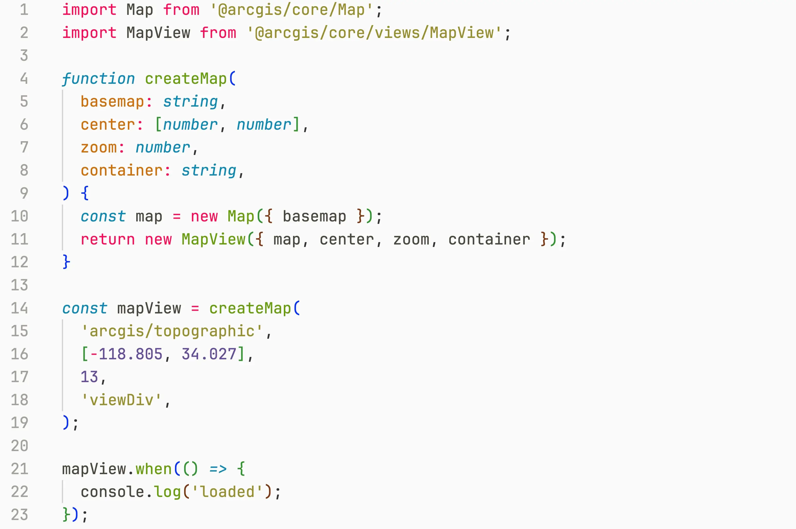
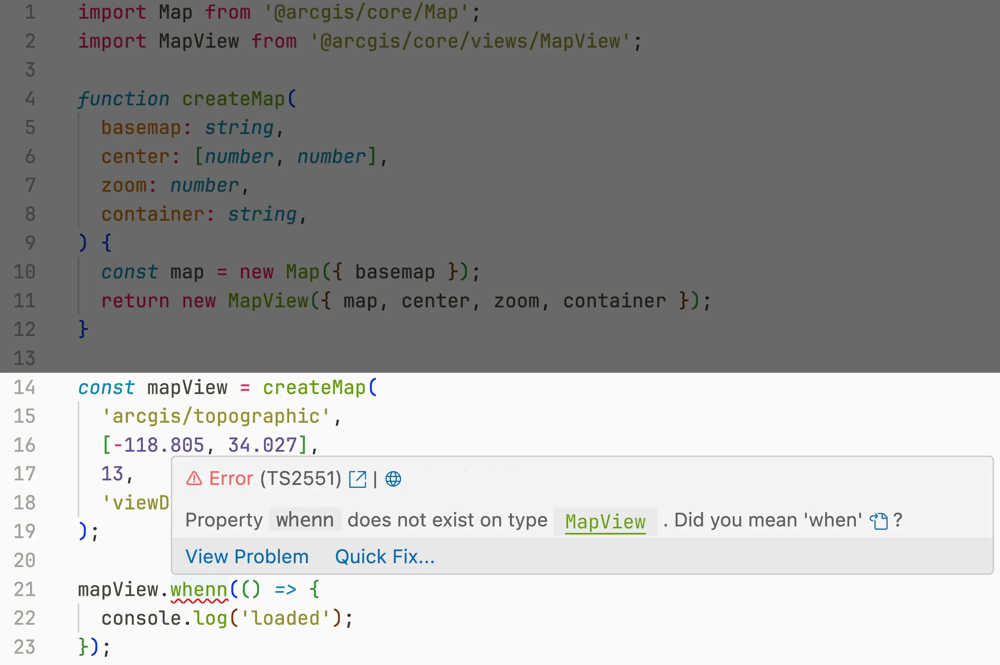
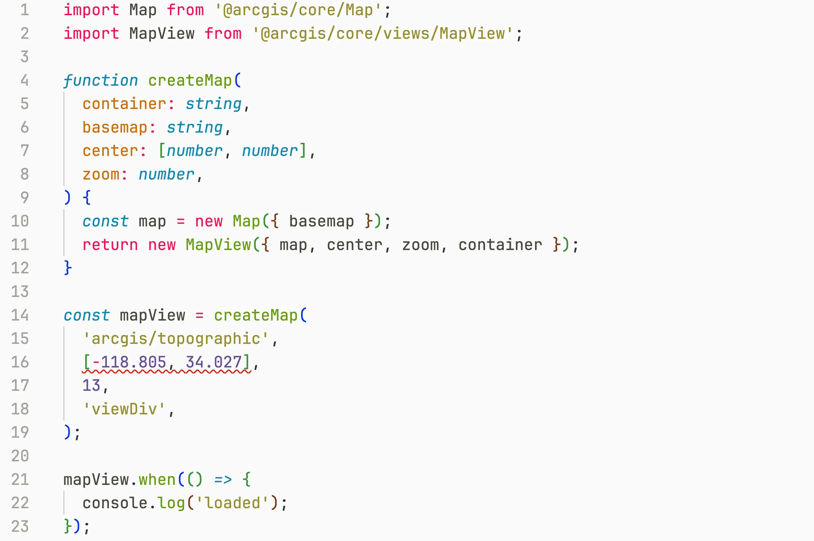
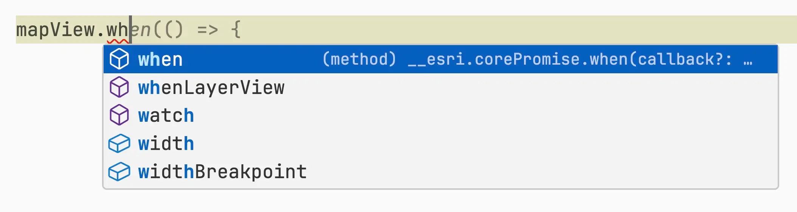
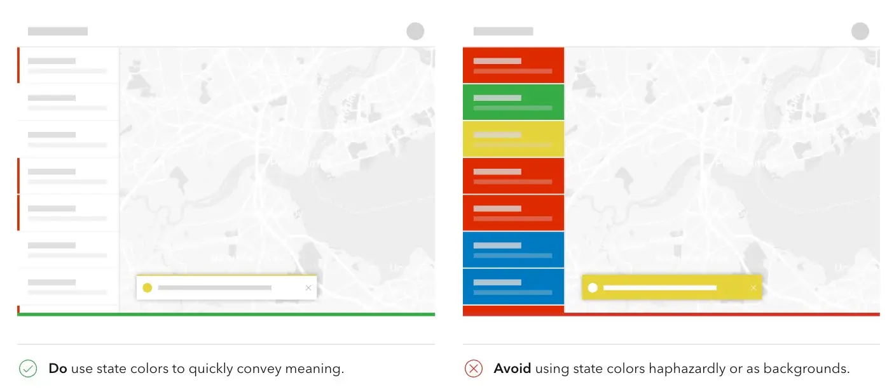

## Overview

- React ⚛️
- TypeScript 🦾
- Calcite 💎
- ArcGIS Maps SDK for JavaScript 📍

> speaker notes:
>
> TODO: Trim content down to 25 minutes
>
> (Ryan) The plan for today is to give you small introduction to the main
> technologies used in building modern web mapping applications. We will cover
> React, TypeScript, Calcite, ArcGIS Maps SDK for JavaScript, and then show how
> all of these are utilized together using a demo application.
>
> (Max) There is a lot to cover today, so let's get started.

## React ⚛️

> A JavaScript library for building dynamic user-interfaces

- Virtual DOM (Document Object Model)
  - Copy of real DOM
  - If there's a change, VDOM will re-render, compare differences between the
    real DOM and virtual DOM, then only the part of the DOM that is changed will
    update, rather than the entire DOM
- Build anything out of small Components
  - Data is transferred from top to bottom
- JSX (JavaScript Syntax Extension).
  - `return <h1>Hello World! 👋</h1>;`
  - JavaScript code in HTML-like syntax

> speaker notes:
>
> (Max) Many of your may already be familiar with React. It isn't just a
> JavaScript library, but a powerful tool for building highly dynamic
> applications, while keeping the codebase maintainable and scalable.
>
> The core idea of React is that instead of making the developer update the
> webpage directly, developer just tells React what the page should look like at
> any given moment - that is called Virtual DOM. Then React takes the Virtual
> DOM, compares it to what's already on the page, and makes the minimum amount
> of changes required to update the page. This results in efficient updates,
> while removing the need for developer to write bug prone imperative code.
>
> React is also keen on keeping your apps maintainable as it grows. It does that
> by encouraging you to build the application out of small components, composing
> them together into larger blocks, and then connecting these blocks to each
> other using one-way flow of data from top components to the bottom ones. This
> might seem like a restriction, but it actually makes the codebase much easier
> to understand and maintain.
>
> React also introduces JSX - which is an optional syntax that bridges the gap
> between HTML and JavaScript, taking the best of both - the **readability** and
> **simplicity** of HTML, combined with the **power** and **flexibility** of
> JavaScript.

## TypeScript 🦾

> TypeScript: catch your bugs before your users do

- Helps with refactoring
- Self-documenting code
- Better autocomplete
- Great starting resources

> speaker notes:
>
> (Max) After React, the next core technology of a modern tech stack is
> TypeScript. As soon as you start working on a larger application, you will
> find TypeScript very helpful for keeping the app maintainable. TypeScript
> introduces optional type-annotations and additional type-safety into
> JavaScript.
>
> The best way to describe the main benefit of TypeScript is that it catches
> your bugs before your users do.

## TypeScript 🦾



> speaker notes:
>
> (Max) For an example of TypeScript in action, let's say you have a function
> that takes map parameters and returns a map view. TypeScript will make sure
> that where this function is used, all the required arguments are provided, and
> in correct order.
>
> It's also going to check that you are using the value that the function
> returned correctly - for example, it will make sure that you treating a string
> as a number, or that you are not trying to access an unknown property or the
> value that your function returned.

## TypeScript 🦾



> speaker notes:
>
> (Max) For example, see this case where I made a typo in the when method.
> TypeScript not only discovers the issue, but suggests that we likely meant to
> type "when" instead

## TypeScript 🦾



> speaker notes:
>
> (Max) Besides helping you catch typos and data handling errors, TypeScript is
> awesome for giving you extra confidence when you do code refactoring. As, on
> any changes, to the function, TypeScript will make sure that everywhere you
> use this function, you updated the code as appropriate if necessary. For
> example, if I reorder the arguments in my `createMap` function, TypeScript
> will remind me to also update all the places were I call this function.

## TypeScript 🦾



> speaker notes:
>
> (Max) Even better, since TypeScript knows so much about your application, like
> your function signatures, and what properties your objects have, it can
> provide much better autocomplete suggestions. See how it suggests `when`
> method in this case based on all methods that map view has.
>
> Needless to say, TypeScript will help you catch a lot of bugs, and improve the
> developer experience a lot.
>
> Speaking of developer experience, ArcGIS Maps SDK for JavaScript itself is
> written in TypeScript, so it provides a great developer experience for
> TypeScript users. And, we have great quick start guides and sample apps. We
> will share those with you at the end of the presentation.

## Calcite Design System 💎

- A comprehensive library of over 50 web components, 2000+ icons, and extensive
  color schemes designed for building accessible, on-brand web applications.
  - [Documentation](https://developers.arcgis.com/calcite-design-system/)
- **Framework-Agnostic**: Easily integrates with any development framework,
  including a seamless experience for React apps.
- **Web Components**: Utilizes the standard web technology for reusable UI
  components, ensuring compatibility and reusability across projects.
  - Calcite Components React

> speaker notes:
>
> (Max) Finally, we get to the main topic of today's presentation. Calcite
> Design System is a toolkit designed to empower you to build user friendly web
> mapping applications with less effort. It provides a comprehensive library of
> over 50 components, 2000+ icons, alongside hand-picked color schemes and
> expert advise.
>
> The unique part of Calcite Components is that they framework-agnostic, meaning
> they works with your favorite framework, whatever it is. This is because
> Calcite Components are built on Web Components - a web standard for reusable
> UI elements.
>
> Web Components are still a relatively new technology, but the community is
> already excited about the potential they bring. They work out of the box in
> many tech stacks. However, using Calcite Components in React requires a tiny
> wrapper library - this library is there to improve integration with the React
> coding patterns. React team is working on supporting web components out of the
> box, like all other major frameworks do, and they are expected to release full
> support in the next major release. Until then, Calcite team ships a Calcite
> Component React library, which we would be using it today's demo.

## Calcite Design System: Benefits

- Consistent UX; consistent brand identity
- Clear direction for designers and developers; follows best practices
- Reduce effort & cost; speed up updates
- Improve accessibility (WCAG 2.1 AA); comply with web-standards
- Completely free to use!



> speaker notes:
>
> (Max) Now that we covered a bit about what Calcite Design System is, let's
> talk about it's benefits for you and your users.
>
> First and foremost, a design system ensures a consistent user experience
> across all your applications, reinforcing the brand's identity. Consistency is
> also appreciated by users as it makes it easier for them to learn your
> application and to switch between the products you provide.
>
> Moreover, Calcite provides clear guidelines for both designers and developers.
> You can see one such guideline on this side. Their guidelines are based on
> years of experience developing Esri's products. Calcite has both general
> guidelines to follow, as well as component-specific recommendations on the
> documentation page for each component.
>
> But perhaps the most compelling benefit of adopting Calcite is how it reduces
> the effort and cost associated with developing and maintaining your
> application. By using a library of pre-designed components, you can speed up
> development and push updates faster. This directly translates to cost savings
> and allows your team to focus on what really matters - the content of your
> application, rather than reinventing Buttons and Dialogs over and over again.
>
> Finally, but not least important, Calcite team has several accessibility
> experts on their team, and they ensure that all components are accessible and
> compliant with applicable standards. This directly improves the User
> Experience, and makes it easier for you to comply with the law.
>
> As you can see, there are a lot of completing reasons to try out Calcite
> Design System. We adapted Calcite widely inside Esri, and it's been of great
> benefit to us. I would encourage you to try building a small app using Calcite
> Components and see how it works for you.

## ArcGIS Maps SDK for JavaScript 📍

> Empower your web apps with geospatial web technology

- 2D and 3D
- Extensive API for working with geographic data
- Geometry engine, utility networks, spatial analysis, and more
- Great developer experience with TypeScript; supports both CDN and ESM
- Extensive documentation
- 50+ Widgets. **New:** now available as Web Components ✨

```html
<arcgis-map item-id="d5dda743788a4b0688fe48f43ae7beb9">
  <arcgis-search position="top-right" />
  <arcgis-legend position="bottom-left" expandable />
  <arcgis-basemap-toggle position="bottom-right" />
</arcgis-map>
```

> speaker notes:
>
> (Max) Last technology we will cover today is the ArcGIS Maps SDK for
> JavaScript - the most powerful web mapping library out there. It takes on the
> heavy lifting of displaying geographic information in 2D and 3D, and comes
> with many out-of-the-box Widgets, powerful utilities like geometry engines,
> and an extensive API for working with geographic data.
>
> We recently made all widgets available as Web Components to make it even
> easier to build applications with just a few lines of code - take a look at
> the tiny code sample on the slide - that creates a map with 3 widget in just 5
> lines of HTML.
>
> Now I will hand it over to Ryan. He will show you how all the technologies we
> just talked about (React, TypeScript, Calcite and ArcGIS Maps SDK for
> JavaScript) can be used together to create great web mapping applications.

## Development Environment Setup

Installation:

```sh
npm vite@latest
npm install @esri/calcite-components-react
npm install @arcgis/core
```

Add copy script and build scripts:

```json
  "scripts": {
    "start": "npm run copy && vite",
    "build": "npm run copy && vite build",
  },
```

> speaker notes:
>
> (Ryan) To start, create the app using the React builder of your choice. For
> this example here, we’re using Vite's CLI to create a TypeScript React
> application.
>
> Next, install calcite-components-react. We don’t need to install
> calcite-components because it’s a dependency of this package.
>
> Install the ES module build of ArcGIS API for JS
>
> And finally, install ncp. We'll use that to copy the assets over. This allows
> icon to show and the date picker to be properly translated.

## Layout + Feature

> speaker notes:
>
> (Ryan)

## Good practices

- Check Maps SDK release notes
- Update to new version regularly
- Use GitHub Dependabot to receive alerts of new versions and security fixes
- Learn your tools well
  ([Browser DevTools](https://developer.chrome.com/docs/devtools/), IDE),
- Write Unit tests and other types of tests for your code - will give you
  confidence that changes to the app in one place didn't break something else

> speaker notes:
>
> (Max) A few final words of advice:
>
> - We introduce many cool features with every Maps SDK release, and you don't
>   want to miss out on them. So update to the newest version regularly and
>   check the release notes for each version.
> - For apps that deal with sensitive data, it's especially important to keep
>   all dependencies of your project up to date. Security vulnerabilities are
>   discovered and fixed all the time, and it's hard to keep up with all of
>   them. Fortunately, GitHub has a tool called Dependabot that updates your
>   dependencies automatically and opens a Pull Request for you to review.
> - Next, you should learn the tools you use often very well. Mastering your IDE
>   and Browser DevTools would make you much more productive and extend your
>   capabilities greatly.
> - Finally, as soon as your app is more than a single page, changes in one part
>   of the app could have unexpected consequences on a different page. Verifying
>   that everything works correctly in every possibly scenario is very time
>   consuming and error prone, and frankly, not very fun. That is why it's an
>   industry best practice to write automated tests for your applications. These
>   could be as simple as making sure your function does some computation
>   correctly, to some as complex as clicking though your app with a virtual
>   mouse, while taking screenshots in the process and comparing them to the
>   expected result.

TODO: mention where we are at the expo
