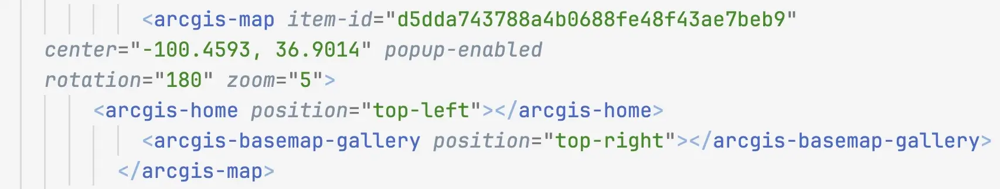
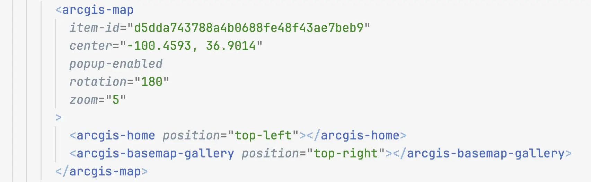
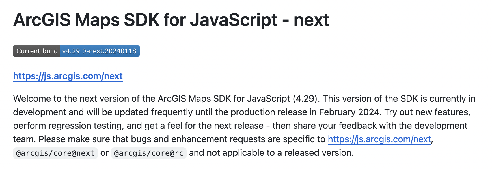
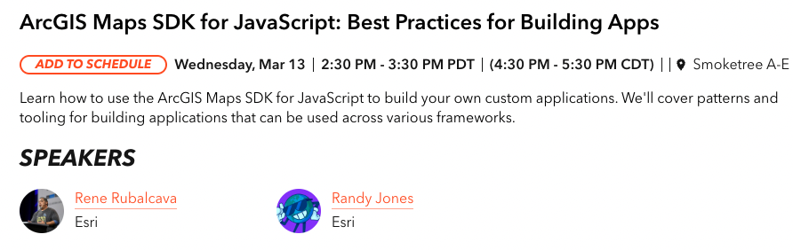
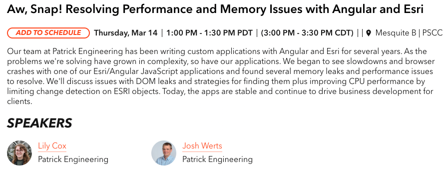

# Overview

- Setting up your dev environment 🧑‍💻

- Troubleshoot web applications 💥
  - DevTools intro
  - AI-based tools and helpers
  - Tips & Tricks

- Maps SDK resources 📍

> speaker notes:
>
> TODO: trim it down to 45 minutes
>
> (Max) We will begin this session with a guide to setting up your development
> environment for productivity.
>
> Then, would dive deep into Developer Tools available in the browser, try out
> debugging an application and examine helpful AI-based tools.
>
> Finally, we would conclude with a list of resources available for the Maps SDK
> for JavaScript for further learning.
>
> (Noah) There's a wealth of knowledge we're eager to share, so let's get
> started.

## Setting up your dev environment

## Code Editor

VS Code (other options available)
  - Syntax highlighting 🏳️‍🌈
  - Code Hinting 💬
  - Git integration 🌳
  - Theming 😎
  - Task integration ⛑️

> speaker notes:
>
> (Max) As a developer, you would be spending a lot of time in the code editor,
> so picking the right one and configuring it to your liking can save you hours
> down the road.
>
> If you already know which code editor or IDE you prefer, that is awesome! If
> you are just getting started and aren't sure, VS Code is a great choice.
>
> Lets look at some useful tools that a good editor provides: (read the slide)

## Code Editor: Prettier



▼



> speaker notes:
>
> (Max) The most helpful tool for improving developer productivity, is a code
> formatter. Prettier is the most popular choice and comes installed by default
> in many editors. If you have a formatter configured to run on save, you can
> write code without worrying about formatting, and Prettier will take care of
> making the code look good for you.
>
> Take a look at these before and after images to show how much clear formatting
> helps, and Prettier can do that for you automatically.

## Code Editor: ESLint


> speaker notes:
>
> (Max) Code Quality becomes very important as the project grows. Good code is
> hard to define, but in general it makes it easier for your teammates and the
> future you to understand what the code is doing, and to make modifications as
> necessary.
>
> ESLint is a popular choice for enforcing code quality. It's like having an
> experienced developer behind your back, reviewing every line you type, giving
> you advice and mentoring you on how to improve the code.
>
> In this small example, ESLint suggests we define our variable as "const"
> rather than "let" given that we don't modify it anywhere else in the code.
> Later, ESLint also notices that we are comparing the variable to itself, which
> is a potential bug.

## Code Editor: Live reload

VS Code extensions:

- Browser Lite
- LiveServer
- entire Edge browser with DevTools inside of VS Code

> speaker notes:
>
> TODO: these tools serve a similar purpose, but with different levels of
> complexity. Should we simplify to mention just one? Edge browser inside of VS
> Code is definitely the most powerful, though also more complex to setup.
>
> (Noah) While developing your app, you probably are making a lot of small
> changes, checking if the app works, and changing things again if it doesn't.
> Normally, you would have to reload the page after every change to see the
> effect, but there are several tools that can apply your changes as soon as you
> typed them, without reloading the page - that saves a lot of time.
>
> There are several VS Code extensions for that, as well as command line
> utilities. On this slide you can see 3 recommended extensions.

## Code Editor: Git

VS Code extensions: GitLens, Github Pull Requests & Issues


> speaker notes:
>
> (Noah) Whether you are working alone, or in a group of developers, tracking
> the code changes is important as that makes it easy to see who changed what,
> when, and why. It also makes it easy to roll back changes if something goes
> wrong. And even more importantly, it prevents you from accidentally loosing
> your work.
>
> Git is the most popular version control system, paired with GitHub for hosting
> Git repositories. However, using Git from the command line is not the most
> approachable for beginners. Fortunately, VS Code comes with two great
> extensions for Git built in.
>
> The image on this slide shows GitLens in action. It visualizes the recent Git
> commit history, and summarizes the changes from you and your peers.

## TypeScript

> TypeScript: catch your bugs before your users do

- Helps with refactoring
- Self-documenting code
- Better autocomplete

> speaker notes:
>
> (Max) As soon as you start working on a larger application, you will find
> TypeScript very helpful for keeping the app maintainable. It's a superset of
> JavaScript that introduces type-safety into the code.
>
> This helps with catching typos and other errors before the user does. It also
> makes refactoring apps much easier as TypeScript will point out if a new
> feature you added requires code changes in other parts of the app.
>
> Finally, TypeScript gives the editor more understanding of how your app works,
> which in turns makes for much better autocomplete when typing.
>
> ArcGIS Maps SDK for JavaScript has quick start guides for TypeScript, as well
> as sample apps

## Troubleshoot web applications

## DevTools

> Debugging tools === Productive programmers

- Breakpoints 🔴
- Network Traffic 🌐
- Console 📃
- CSS inspection 💎
- and much more! 🛠️

> speaker notes:
>
> (Max) Each browser ships with extremely powerful debugging and inspector
> tools. These should be developer's best friend as they help you diagnose even
> complex issues quickly.
>
> Browser based tools allow you to debug the application, inspect page styles,
> monitor network traffic, test accessibility and many more. In the next section
> of this presentation we will go over some of the most important capabilities
> of DevTools.

## Debugging: Breakpoints

- Various ways to pause code
- `debugger;`
- Blackboxing (from context menu)
- stop on (un)caught exceptions


[Debugging demo](https://developers.arcgis.com/javascript/latest/sample-code/widgets-search-3d/live/index.html)

> speaker notes:
>
> (Max)

## Debugging: Network requests

- Records all network requests
- Tip: Hold refresh button - empty cash and hard reload
- Inspect network traffic, e.g.
  - Search widget not displaying properly
  - Print task not executing as expected
  - Querying layer features


[Network demo](https://developers.arcgis.com/javascript/latest/sample-code/widgets-search-3d/live/index.html)

> speaker notes:
>
> (Max)

## Debugging: Philosophy

Narrow down the issue:

- App specific
- API specific
- Server-side issue
- Are any 3rd party resources involved?

When debugging, isolate the issue to smaller and smaller reproducible case until
figured out what is the cause

- Is the problem with how the code is written?
- Is the issue on the client (API) or server?
- Is there a performance issue?
- Is the issue with the data?


Use version control like Git, and make regular small commits to see a history of
changes. This also allows to see what needs to be rolled back if things broke
suddenly.

[Detailed guide](https://ntietz.com/blog/how-i-debug-2023/)

> speaker notes:
>
> (Max)

## Debugging: AI helpers and extensions

- ChatGPT/Bard/Bing AI/Claude
- VS Code Chat ("Explain this error")
- GitHub Copilot/InteliiSence/Tabnine AI
- Code Spell Checker (helps catch typos)
- Whatever tool/library you use, search for VS Code extensions that could
  improve integration with it:
  - Jest
  - Webpack
  - Vite
  - React

> speaker notes:
>
> (Max)

## Console

- Tip: can copy-paste into console to pretty-print JSON
- Log diagnostic info
- Execute JavaScript
- Check values of objects at an app breakpoint

```js
require(['esri/geometry/support/webMercatorUtils'], function (
  webMercatorUtils,
) {
  var extent = this.view.extent;
  var geoExtent = webMercatorUtils.webMercatorToGeographic(extent);
  console.log(JSON.stringify(geoExtent));
});
```

[Console demo](https://github.com/hgonzago/DevSummit-presentations/blob/gh-pages/Dev-Summit-2017/Dev-debug-tips/Demos/dev-tools-demos/console.html)

[Debug Demo](https://developers.arcgis.com/javascript/latest/sample-code/webmap-basic/live/index.html)


> speaker notes:
>
> (Noah)

## Console: Log Messages

- Log your own messages
- Warning message logged by Maps SDK

[](https://hgonzago.github.io/tips-tricks-webinar/Demos/js-demo/index.html)

> speaker notes:
>
> (Noah)

## Console: Custom formatters

[Controls how object values display](https://github.com/ycabon/arcgis-js-api-devtools)


> speaker notes:
>
> (Noah)

## CSS: Color Themes

- Detect user color scheme preferences
  - CSS media feature (light, dark, no-preference)
- Emulate via dev tools


> speaker notes:
>
> (Noah)

## CSS: Inspect Styles

- Inspect element css
- View/toggle classes
- Edit styles applies to element
- Color picker (change color, color contrast)


> speaker notes:
>
> (Noah)

## Elements: Inspect Web Component

- Web-component specific debugging (i.e shadow dom)
  - The Properties tab in devtools

> speaker notes:
>
> (Noah)

## Application

- Cookies
- Local Storage
- App Cache

> speaker notes:
>
> (Noah)

## Emulation: Sensors

- Modify current location and locale

[](https://www.arcgis.com/apps/instant/media/index.html?appid=6df7442815404def91d9196515fa0768)

> speaker notes:
>
> (Noah)

## Emulation: Mobile

- Mobile emulation
- Throttling


> speaker notes:
>
> (Noah)

## Remote Debugging - iOS and Android

More accurate, but requires physical device

> speaker notes:
>
> (Max)

## Lighthouse

TODO

> speaker notes:
>
> (Max)

## Lighthouse: Accessibility

- axe
- Audits
- Color Contrast
- Extensions
- Axe Coconut (similar to Chrome Canary or Firefox nightly)
- Axe a11y extension
- ChromeVox screen reader

- Other Dev Summit sessions on accessibility:
  - TODO

> speaker notes:
>
> (Max) mention importance of Accessibility

## View events

- [Handling Events](https://developers.arcgis.com/javascript/latest/api-reference/esri-views-MapView.html#events)

[](hhttps://developers.arcgis.com/javascript/latest/sample-code/event-explorer/)

> speaker notes:
>
> (Max)

## Constrain visible extent

Use constraint geometry to

- Restrict map area
- Limit search results

[Demo](https://hgonzago.github.io/DevSummit-presentations/Dev-Summit-2021/Debugging-tips-tricks/demos/restrict_extent.html)

> speaker notes:
>
> (Max) go over this quickly as it was mentioned recently

## Request interceptor

- [RequestInterceptor](https://developers.arcgis.com/javascript/latest/api-reference/esri-config.html#RequestInterceptor)
  - Add headers
  - Changes before request is sent
  - Changes after request is sent but before returned to caller
  - Log error info for specfic layer errors

[Real World Example](https://community.esri.com/t5/arcgis-api-for-javascript/how-to-use-a-key-in-an-esrirequest-call/m-p/298401)

> speaker notes:
>
> (Max) go over this quickly as it was mentioned recently

## Snippet

- Create code snippets to run in browser dev tools


> speaker notes:
>
> (Max)

## Create Live Expression

- Get coordinates as you navigate the map


> speaker notes:
>
> (Max)

## Maps SDK Resources

## Maps SDK Resources

[](https://github.com/Esri/jsapi-resources)

- TypeScript definition file
- Build tools, e.g. Webpack
- OAuth Callback

> speaker notes:
>
> (Max)

## Good practices

- Check Maps SDK release notes
- Update to new version regularly
- Use GitHub Dependabot to receive alerts of new versions and security fixes
- Write Unit tests and other types of tests for your code - will give you
  confidence that changes to the app in one place didn't break something else

> speaker notes:
>
> (Max) A few final words of advice:
>
> - We introduce many cool features with every Maps SDK release, and you don't
>   want to miss out on them. So update to the newest version regularly and
>   check the release notes for each version.
> - For apps that deal with sensitive data, it's especially important to keep
>   all dependencies of your project up to date. Security vulnerabilities are
>   discovered and fixed all the time, and it's hard to keep up with all of
>   them. Fortunately, GitHub has a tool called Dependabot that updates your
>   dependencies automatically and opens a Pull Request for you to review.
> - Finally, as soon as your app is more than a single page, changes in one part
>   of the app could have unexpected consequences on a different page. Verifying
>   that everything works correctly in every possibly scenario is very time
>   consuming and error prone. That is why it's an industry best practice to
>   write automated tests for your applications. These could be as simple as
>   making sure your function does some computation correctly, to some as
>   complex as clicking though your app with a virtual mouse, while taking
>   screenshots in the process and comparing them to the expected result.

## Github repository for testing & feedback

[https://github.com/Esri/feedback-js-api-next](https://github.com/Esri/feedback-js-api-next)



## ArcGIS Maps SDK for JavaScript - next

[https://github.com/Esri/feedback-js-api-next](https://github.com/Esri/feedback-js-api-next)


CDN:

```html
<link
  rel="stylesheet"
  href="https://js.arcgis.com/next/esri/themes/light/main.css"
/>
<script src="https://js.arcgis.com/next/"></script>
```


NPM:

```sh
npm install arcgis-js-api@next
```

> speaker notes:
>
> (Noah)

## Related Sessions





> speaker notes:
>
> (Noah)

## Questions?

Slides & Notes:
[bit.ly/esri-2024-debugging-tips-and-tricks](https://bit.ly/esri-2024-debugging-tips-and-tricks)


> speaker notes:
>
> If you wish to dive deeper, you can find our slides and additional resources
> at the URL above, or you can scan the QR code.
