# Overview

- Setting up your dev environment 🧑‍💻

- Troubleshoot web applications 💥
  - DevTools intro ️⚙️
  - AI-based tools and helpers 🤖
- ArcGIS Maps SDK for JavaScript 🗺️
  - Tips & Tricks 🎯
  - Resources 📍

> speaker notes:
>
> The content we will cover today is applicable to web development in general,
> but we will tell it in the context of the ArcGIS Maps SDK for JavaScript
>
> (Max) We will begin this session with a guide to setting up your development
> environment for productivity.
>
> Then, we would dive deep into Developer Tools available in the browser, try
> out debugging an application and examine helpful AI-based tools.
>
> Finally, we would conclude with a list of resources available for the Maps SDK
> for JavaScript for further learning.
>
> Besides what is covered in this presentation, we have great supplemental
> resources for those who wish to dive deeper. We will share a link to all these
> resources at the end of the presentation.
>
> There's a wealth of knowledge we're eager to share, so let's get started.

## Setting up your dev environment

## Code Editor

VS Code (other options available)

- Syntax highlighting 🏳️‍🌈
- Code Hinting 💬
- Git integration 🌳
- Theming 😎
- Task integration ⛑️

> speaker notes:
>
> (Max) As a developer, you would be spending a lot of time in the code editor,
> so picking the right one and configuring it to your liking can save you hours
> down the road.
>
> If you already know which code editor or IDE you prefer, that is awesome! If
> you are just getting started and aren't sure, VS Code is a great choice.
>
> Lets look at some useful tools that you should configure in your editor:

## Code Editor: Prettier 💅


> speaker notes:
>
> (Max) The most helpful tool for improving developer productivity, is a code
> formatter. Prettier is the most popular choice and comes installed by default
> in many editors. If you have a formatter configured to run on save, you can
> write code without worrying about formatting, and Prettier will take care of
> making the code look good for you.
>
> Take a look at these code samples. In both cases, I am using the newly
> released mapping components. But, after running Prettier, indentation is
> improved and the code becomes much more readable - isn't it awesome that it
> can do all of that for you automatically?

## Code Editor: ESLint 🚩


> speaker notes:
>
> (Max) Code Quality becomes very important as the project grows. Good code is
> hard to define, but in general it makes it easier for your teammates and the
> future you to understand what the code is doing, and to make modifications as
> necessary.
>
> ESLint is a popular choice for enforcing code quality. It's like having an
> experienced developer behind your back, reviewing every line you type, giving
> you advice and mentoring you on how to improve the code.
>
> In this small example, ESLint suggests we define our variable as "const"
> rather than "let" given that we don't modify it anywhere else in the code.
> Later, ESLint also notices that we are comparing the variable to itself, which
> is a potential bug.
>
> The especially cool part is that many ESLint warnings are auto-fixable, so
> ESLint can improve your code for you.

## Code Editor: Live reload

LiveServer VS Code extension:

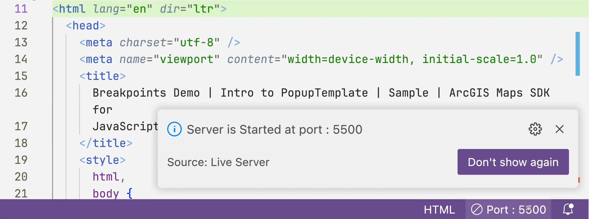

> speaker notes:
>
> (Max) While developing your app, you probably are making a lot of small
> changes, checking if the app works, and changing things again if it doesn't.
> Normally, you would have to reload the page after every change to see the
> effect, but with an IDE extension like LiveServer in VS Code, the page reloads
> automatically as soon as you hit save.
>
> Modern web frameworks like React come with even more advanced tools available,
> that can update only the necessary parts of the webpage, without reloading the
> whole page.

## Code Editor: Git 🌳

VS Code extensions: GitLens, Github Pull Requests & Issues


> speaker notes:
>
> (Max) Whether you are working alone, or in a group of developers, tracking the
> code changes is important as that makes it easy to see who changed what, when,
> and why. It also makes it easy to roll back changes if something goes wrong.
> And even more importantly, it prevents you from accidentally loosing your
> work.
>
> I remember working on an e-commerce website 6 years ago. I didn't use version
> control system, and I accidentally deleted two weeks worth of work. The
> deadline for the project was approaching, and so I had to spend two whole days
> morning till late evening to try to recreate the code from memory. From that
> point on, I use version control on every project.
>
> Git is the most popular version control system. And it's often paired with
> GitHub for hosting Git repositories. However, using Git from the command line
> is not the most approachable for beginners. Fortunately, VS Code comes with
> two great extensions for Git built in.
>
> The image on this slide shows GitLens in action. It visualizes the recent Git
> commit history, and summarizes the changes from you and your peers.
>
> The other extension, GitHub Pull Requests & Issues, lets you interact with
> GitHub without leaving your IDE.

## TypeScript 🦾

> TypeScript: catch your bugs before your users do

- Helps with refactoring
- Self-documenting code
- Better autocomplete
- Great starting resources

> speaker notes:
>
> (Max) As soon as you start working on a larger application, you will find
> TypeScript very helpful for keeping the app maintainable. TypeScript
> introduces optional type-annotations and additional type-safety into
> JavaScript.
>
> The best way to describe the main benefit of TypeScript is that it catches
> your bugs before your users do.

## TypeScript 🦾


> speaker notes:
>
> (Max) For an example of TypeScript in action, let's say you have a function
> that takes map parameters and returns a map view. TypeScript will make sure
> that where this function is used, all the required arguments are provided, and
> in correct order.
>
> It's also going to check that you are using the value that the function
> returned correctly - for example, it will make sure that you treating a string
> as a number, or that you are not trying to access an unknown property or the
> value that your function returned.

## TypeScript 🦾

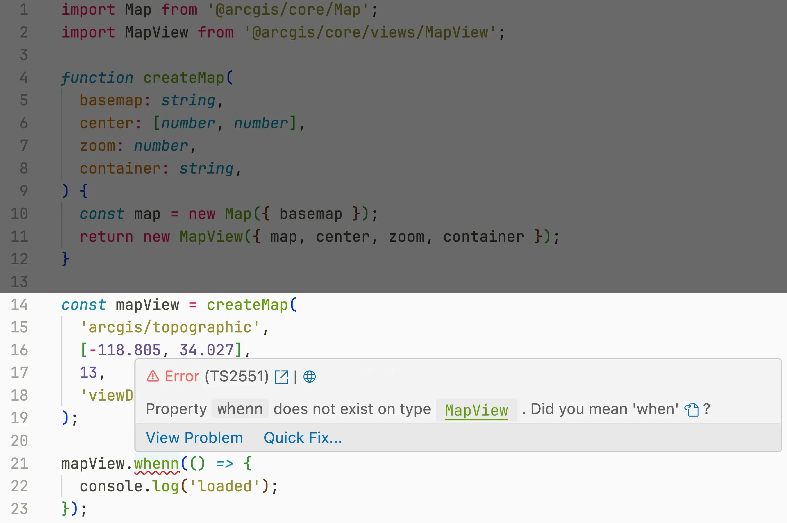

> speaker notes:
>
> (Max) For example, see this case where I made a typo in the when method.
> TypeScript not only discovers the issue, but suggests that we likely meant to
> type "when" instead

## TypeScript 🦾

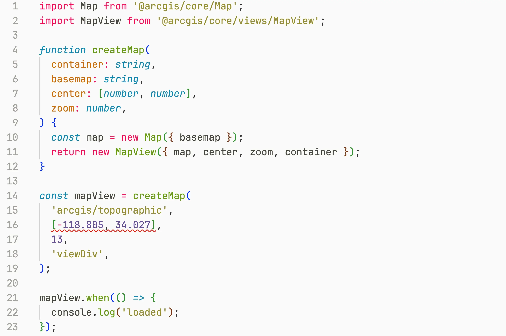

> speaker notes:
>
> (Max) Besides helping you catch typos and data handling errors, TypeScript is
> awesome for giving you extra confidence when you do code refactoring. As, on
> any changes, to the function, TypeScript will make sure that everywhere you
> use this function, you updated the code as appropriate if necessary. For
> example, if I reorder the arguments in my `createMap` function, TypeScript
> will remind me to also update all the places were I call this function.

## TypeScript 🦾


> speaker notes:
>
> (Max) Even better, since TypeScript knows so much about your application, like
> your function signatures, and what properties your objects have, it can
> provide much better autocomplete suggestions. See how it suggests `when`
> method in this case based on all methods that map view has.
>
> Needless to say, TypeScript will help you catch a lot of bugs, and improve the
> developer experience a lot.
>
> Speaking of developer experience, ArcGIS Maps SDK for JavaScript itself is
> written in TypeScript, so it provides a great developer experience for
> TypeScript users. And, we have great quick start guides and sample apps. We
> will share those with you at the end of the presentation.

## Troubleshoot web applications

## DevTools ⚙️

> Debugging tools === Productive programmers

- Breakpoints 🔴
- Network Traffic 🌐
- Console 📃
- CSS inspection 💎
- and much more! 🛠️

> speaker notes:
>
> (Max) Each browser ships with extremely powerful debugging and inspector
> tools. These should be developer's best friend as they help you diagnose even
> complex issues quickly.
>
> Browser based tools allow you to debug the application, inspect page styles,
> monitor network traffic, test accessibility and many more. In the next section
> of this presentation we will go over some of the most important capabilities
> of DevTools.

## Debugging: Breakpoints 🔴


> speaker notes:
>
> (Max) First, let's talk about debugging. As far as the basics of debugging
> goes, DevTools lets you set a breakpoint on some line of code, and when the
> browser reaches that line, it will pause the code execution, and let you
> inspect the values of all variables at that point.
>
> For example, in this small code snippet, we set a breakpoint for when the view
> is ready. When the browser reaches that line, it will pause the code
> execution. At which point you can inspect the values of all the variables, as
> well as execute arbitrary JavaScript code in the console below.

## Debugging: Logpoints

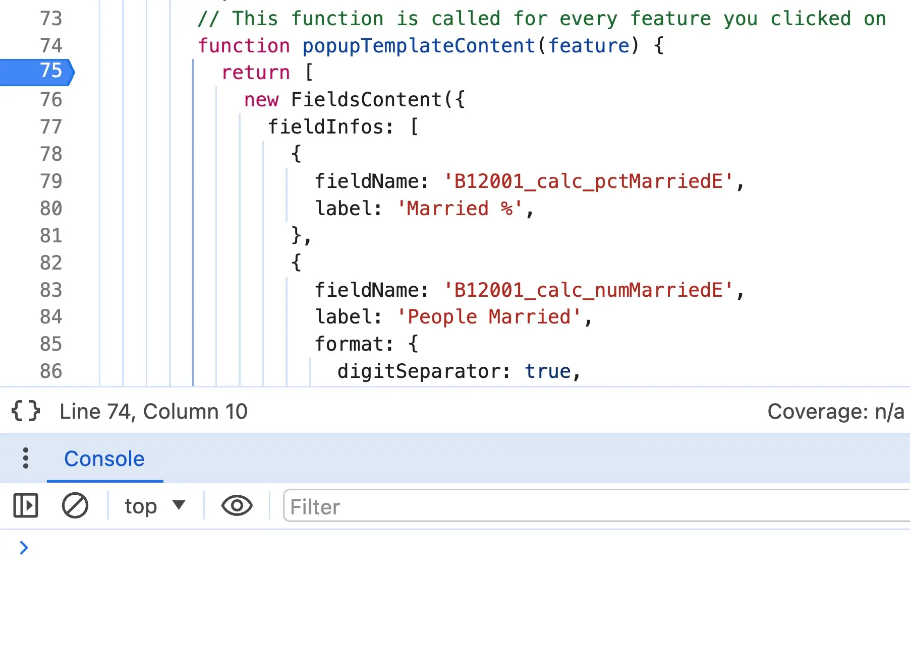

> speaker notes:
>
> (Max) Besides regular breakpoints, we have logpoints, which are like
> `console.log`, but better in several ways.
>
> If you have a regular breakpoint, you can convert it into a logpoint by
> right-clicking on it to open the context menu.

## Debugging: Logpoints

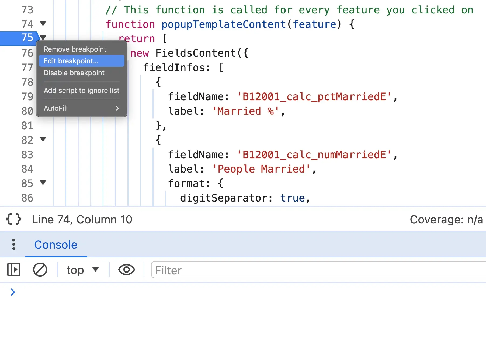

> speaker notes:
>
> (Max) In the list of options, pick "Edit breakpoint"

## Debugging: Logpoints

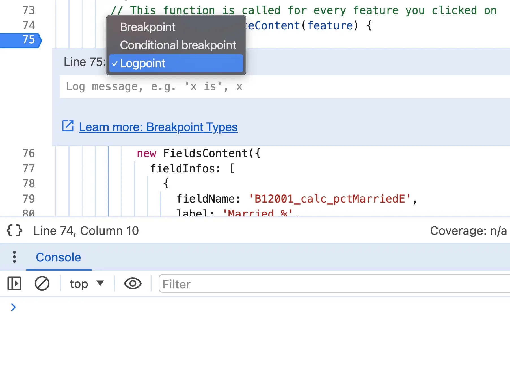

> speaker notes:
>
> (Max) Then change the breakpoint type to "Logpoint"

## Debugging: Logpoints

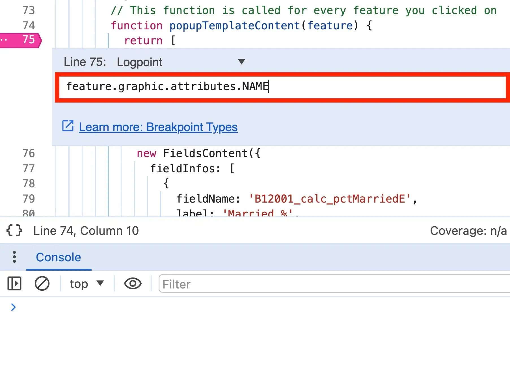

> speaker notes:
>
> (Max) And that gives us an input to enter logpoint value. Whatever expression
> we put in there, that value would be logged to the console each time the
> logpoint is hit.
>
> In our example, the logpoint is inside a function that defines the popup
> content for a given feature, so let's log the feature name in the logpoint

## Debugging: Logpoints

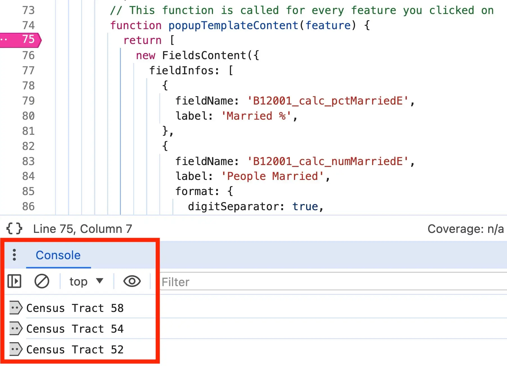

> speaker notes:
>
> (Max) Now that logpoint is created, every time you click on some feature on
> the map, the logpoint will log to console the name of the feature we clicked
> on.
>
> This is like adding `console.log` statements in your code, except you can add
> and logpoints on the fly, without modifying code or reloading the page.

## Debugging: Conditional Breakpoints


> speaker notes:
>
> (Max) Similarly, you can create a conditional breakpoint, that stops only when
> a certain condition is met. For example, you can stop the code execution only
> for a specific feature that you know causes your code to misbehave.

## Debugging: Stop on exceptions


> speaker notes:
>
> (Max) Even better, you can make DevTools stop automatically on any uncaught
> exception. This makes it easier to diagnose an issue, because you can see what
> was the state of your application when an error occurred.

## Debugging: Network requests 🌐

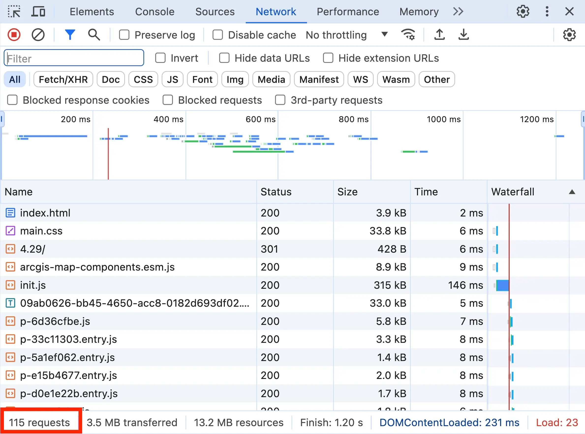

> speaker notes:
>
> (Max) Any web application relies on a back-end service to provide data and
> power features like search and querying. The Network tab in DevTools is
> perfect for inspecting network requests like that.
>
> For example, let's inspect requests to a feature service query endpoint. As
> you can see, we have a lot of requests in this case, so let's use the search
> box to narrow it down to just requests that contain "query" in the URL.

## Debugging: Network requests 🌐

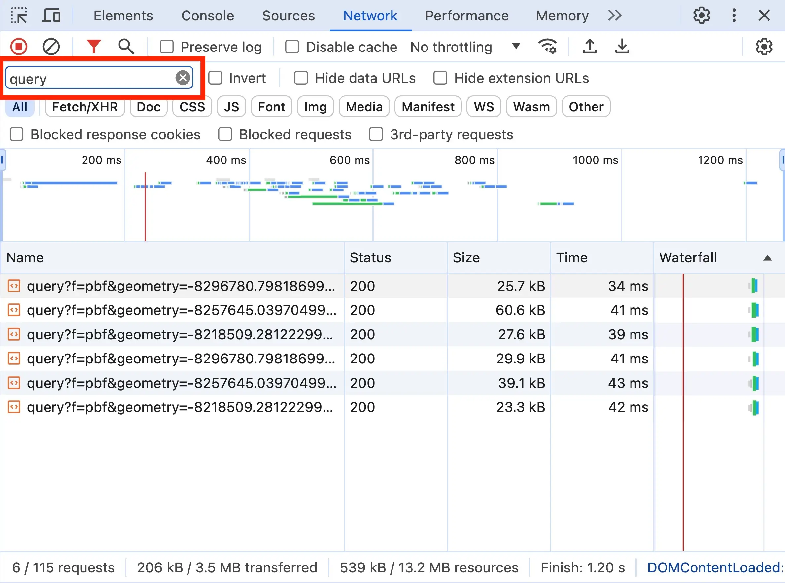

> speaker notes:
>
> (Max) Now we see all requests that contain "query" in the URL. Let's click on
> any of these requests to see more details

## Debugging: Network requests 🌐

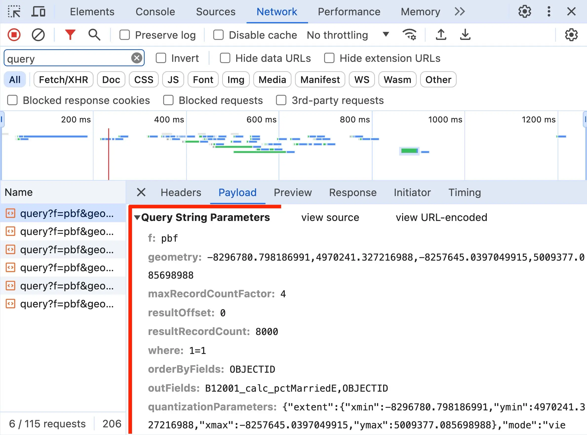

> speaker notes:
>
> (Max) On the "request" tab, you can see what data your browser sent to the
> server. And on the neighboring "response" tab, you can see what data the
> server sent back. This way, we can verify that what data browser sent to the
> server, and what we got back looks good.

## Debugging: Network requests 🌐

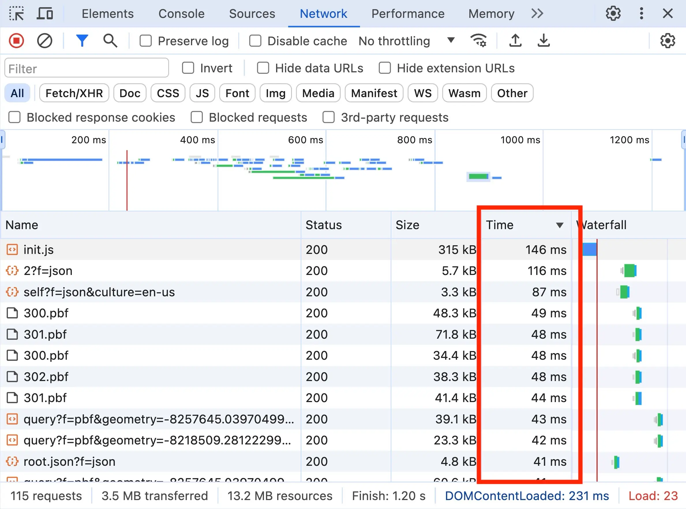

> speaker notes:
>
> (Max) The network tab in DevTools is also useful for diagnosing performance
> issues, as you can see how long each request took to complete.

## Debugging: Network requests 🌐

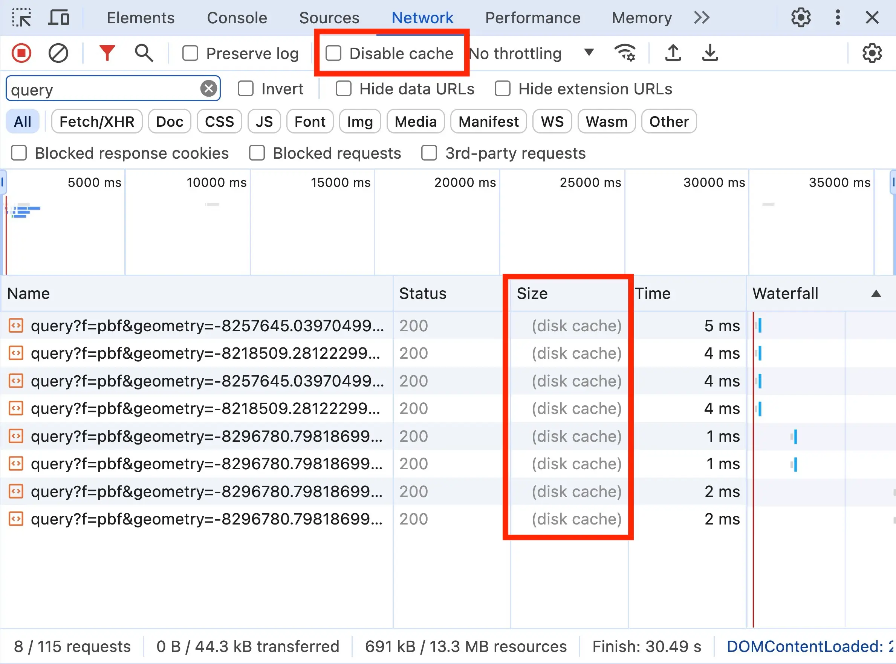

> speaker notes:
>
> (Max) To improve performance, especially for commonly requested resources,
> browsers will commonly cache the network request. This means they will save a
> local copy of the network request and use it instead of making a fresh
> network, resulting in much better performance.
>
> However, this can cause issues in some cases. For example, if the resources on
> the server modified recently, this can cause issues as the browser may use an
> outdated resource.
>
> Similarly, if you wish to test load performance of your application, requests
> being cached may not give you an accurate picture of the performance compared
> to a user who is visiting your site for the first time, as they likely don't
> have any of your resources cached.
>
> For these cases, a "Disable cache" checkbox exists in the network tab. It
> let's you temporary bypass caching of network requests.

## Debugging: Philosophy 🤔

- **Initial Assessment:** Determine if the issue is app-specific, API-specific,
  server-side, or involves third-party resources.
- **Isolation Techniques:** Narrow down the issue by isolating it to the
  smallest reproducible case:
  - Is the problem with the code?
  - Is the issue on the client (API) or server?
  - Is there a performance issue?
  - Is the issue with the data?
- **Version Control:** Utilize Git for tracking changes and facilitating
  rollbacks

> speaker notes:
>
> (Max) That brings us to a very important tips for debugging your apps
> effectively. When the program misbehaves, it's hard to figure out what's going
> on among many moving parts. That's why, ruling out possible causes one by one
> get's you closer to the solution. And not just any solution, but a solution
> where you understand what went wrong and what's the best way to fix it.
>
> Like I mentioned on the previous slide, you can inspect network requests to
> see if the issue is with your browser sending wrong data, or the server
> responding with bad data - just like that, you narrowed down the scope of
> possibilities in half.
>
> For other errors, like state management, or performance issues, you can also
> try temporary disabling some parts of your application so that they don't
> interfere with the debugging process and to rule them out as a possible cause.
> You can keep removing the parts, until you discovered the part that causes the
> problem.
>
> In the process, it's important to use a version control system like Git to
> keep track of the recent changes, so that you can see what change could have
> caused the issue to appear, but also so that you can rollback your application
> once you are done with the debugging.

## Debugging: AI helpers and extensions

- ChatGPT / Gemini / Bing AI / Claude
- VS Code Chat ("Explain this error")
- GitHub Copilot / InteliiSence / Tabnine AI
- Code Spell Checker (helps catch typos)

> speaker notes:
>
> (Max) Finally, a very recent development is the proliferation of AI-based
> helpers. These are great for explaining errors and suggesting solutions. If
> your organization permits these, you should definitely give them a try as they
> can enhance your productivity and abilities.
>
> And as these tools are expected to only get more powerful, getting experience
> with these tools will prepare you for the work environment of the future.

## Debugging: Nice to have

Whatever tool / library you use, search for Browser and IDE extensions that
could improve integration with it:

- React (React DevTools)
- Jest
- Webpack
- Vite

> speaker notes:
>
> (Max) Similarly, there are extensions for browsers and IDEs for better
> integration with development toolkits and libraries. These would improve
> developer experience and productivity.
>
> Now I will hand it over to my colleague, Noah, to give you even more helpful
> tips and tricks for debugging your applications.

## Console

- Log your own messages
- Warning and error messages logged by Maps SDK

[](https://hgonzago.github.io/tips-tricks-webinar/Demos/js-demo/index.html)

> speaker notes:
>
> (Noah)

## Console

- Log diagnostic info
- Execute JavaScript
- Check values of objects at an app breakpoint
- Create _live expression_
- Tip: to pretty-print JSON, paste it into the console, then right-click on it
  and press "Copy object"

```js
const webMercatorUtils = await $arcgis.import(
  'esri/geometry/support/webMercatorUtils',
);
const extent = this.view.extent;
const geoExtent = webMercatorUtils.webMercatorToGeographic(extent);
console.log(geoExtent);
```

> speaker notes:
>
> (Noah)

## Create Live Expression

Example: get coordinates as you navigate the map


> speaker notes:
>
> (Noah)
>
> - require("esri/views/View").views.items[0].extent.center.latitude
> - require("esri/views/View").views.items[0].extent.center.longitude

## CSS: Color Themes

- Detect user color scheme preferences
  - CSS media feature (light, dark, no-preference)
- Emulate (Dev tools --> More tools --> Rendering)


> speaker notes:
>
> (Noah)

## CSS: Inspect Styles

- Inspect element css
- View/toggle classes
- Edit styles applies to element
- Color picker (change color, color contrast)


> speaker notes:
>
> (Noah)

## Emulation: Sensors

- Modify current location and locale

[](https://www.arcgis.com/apps/instant/media/index.html?appid=6df7442815404def91d9196515fa0768)

## Remote Debugging - iOS and Android

More accurate, but requires physical device

## Emulation: Mobile

- Mobile emulation
- Throttling

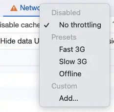

## Emulation: Mobile


## Accessibility

Making content usable for everyone regardless of abilities <br></br> Lighthouse

[https://developer.chrome.com/docs/lighthouse/overview](https://developer.chrome.com/docs/lighthouse/overview)

WAVE

[https://wave.webaim.org/](https://wave.webaim.org/)

## Accessibility

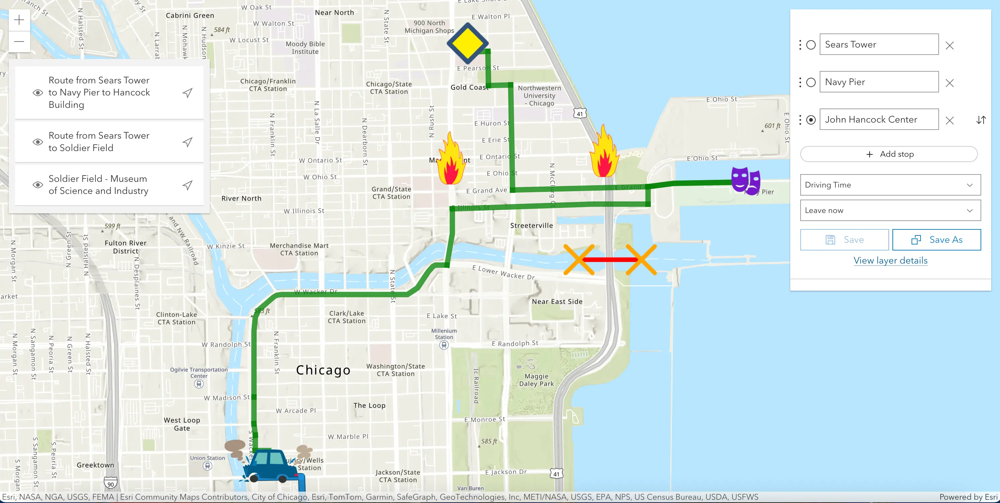

## Accessibility

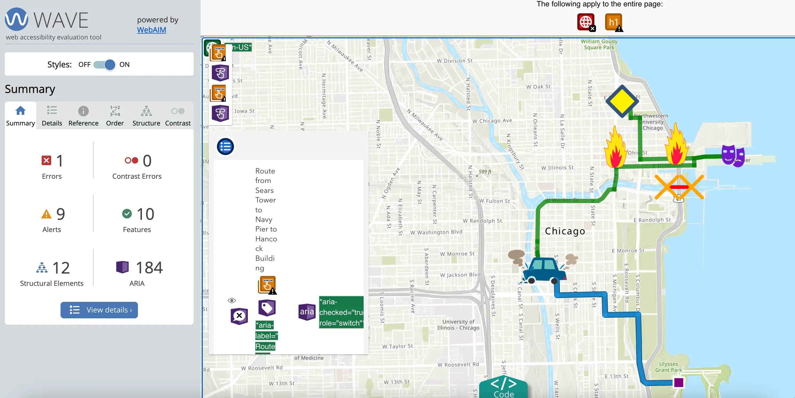

## Accessibility

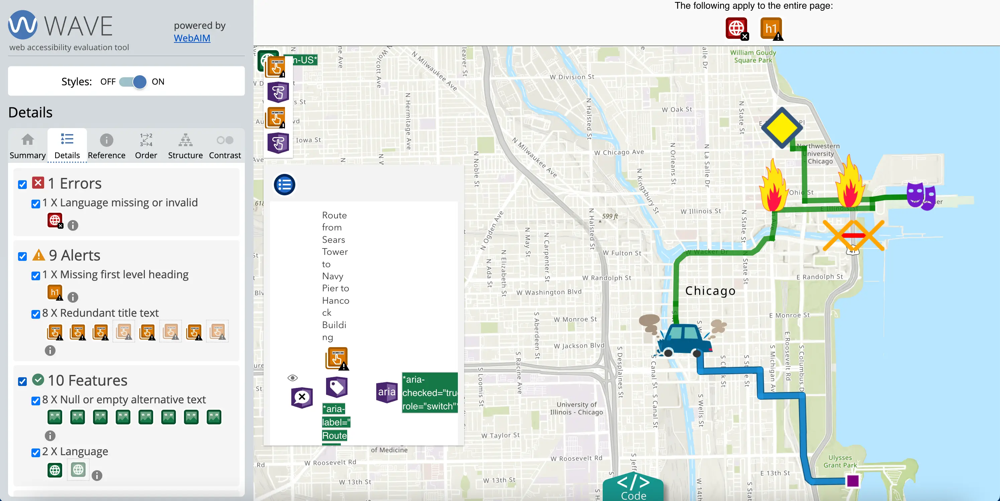

## Maps SDK Tips & Tricks

## View events

- [Handling Events](https://developers.arcgis.com/javascript/latest/api-reference/esri-views-MapView.html#events)

[](https://developers.arcgis.com/javascript/latest/sample-code/event-explorer/)

> speaker notes:
>
> (Noah)

## Request interceptor

- Add headers
- Make changes before request is sent
- Make changes after request is sent, but before returned to caller
- Log error info for specfic layer errors

[https://developers.arcgis.com/javascript/latest/api-reference/esri-config.html#RequestInterceptor](https://developers.arcgis.com/javascript/latest/api-reference/esri-config.html#RequestInterceptor)

## Request interceptor

```js
esriConfig.request.interceptors.push({
  urls: featureLayerUrl,
  before: function (params) {
    if (params.requestOptions.query.maxAllowableOffset) {
      params.requestOptions.query.maxAllowableOffset = 0;
    }
  },
});
```

## Maps SDK Resources

## Maps SDK Resources


A collection of resources for developers using the ArcGIS Maps SDK for
JavaScript
[https://github.com/Esri/jsapi-resources](https://github.com/Esri/jsapi-resources)

## Github repository for testing & feedback

[https://github.com/Esri/feedback-js-api-next](https://github.com/Esri/feedback-js-api-next)


## ArcGIS Maps SDK for JavaScript - next

[https://github.com/Esri/feedback-js-api-next](https://github.com/Esri/feedback-js-api-next)

CDN:

```html
<link
  rel="stylesheet"
  href="https://js.arcgis.com/next/esri/themes/light/main.css"
/>
<script src="https://js.arcgis.com/next/"></script>
```

NPM:

```sh
npm install arcgis-js-api@next
```

## Maps SDK Resources


[https://developers.arcgis.com/javascript/latest/blogs/](https://developers.arcgis.com/javascript/latest/blogs/)

## Maps SDK Resources


[https://developers.arcgis.com/javascript/latest/tooling-intro/](https://developers.arcgis.com/javascript/latest/tooling-intro/)

## Maps SDK Resources


[https://developers.arcgis.com/javascript/latest/community/](https://developers.arcgis.com/javascript/latest/community/)

## Related Sessions


> speaker notes:
>
> (Noah)

TODO: mention where we are at the expo
