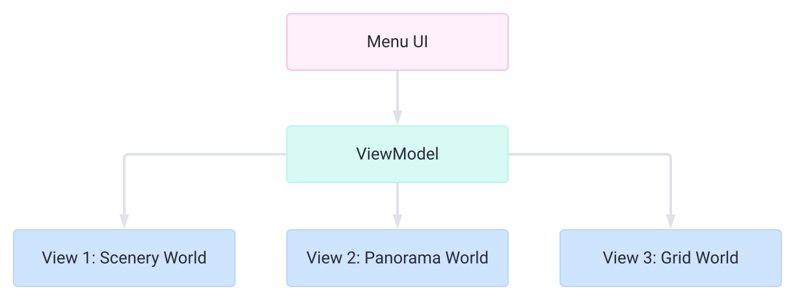

## Trailer

<iframe style="width:80vw;aspect-ratio:16/9" src="https://www.youtube.com/embed/LlDgH-NZ3KE?si=cDXjdgnm6Td9Pyi4" title="YouTube video player" frameborder="0" allow="accelerometer; autoplay; clipboard-write; encrypted-media; gyroscope; picture-in-picture; web-share; fullscreen"></iframe>

## Tech stack

- ArcGIS Maps SDK for JavaScript
  - SceneView
  - Weather effects
  - 3D mesh; sketch edges fill
- Tailwind.css
- TypeScript
- React
- JavaScript

## Architecture & Dev process

## Features

- Special effects & changing weather
- 3 maps:
  - Panorama World - Circle around the downtown of the New York City
  - Scenery World - Hover over the waterfront park of the New York City
  - Grid World - Enjoy simple old-school tetris
- Music (using Spotify's embed API)
- High scores & dynamic difficulty
- Pause, save, load
- Hidden cheat code 😁

## [Live Demo](https://maxpatiiuk.github.io/tetris-react/)

## Questions?

Trailer, source code, and online demo:
[bit.ly/esri-2024-tetris](https://bit.ly/esri-2024-tetris)

> speaker notes:
