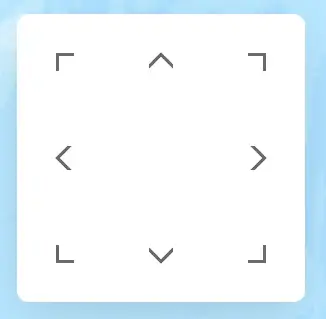

## Gaming with ArcGIS Maps SDK for JavaScript - geo-io

Max Patiiuk

<p style="font-size: 1rem">
  Trailer, source code & live demo:
  <a href="https://bit.ly/esri-2025-geo-io">
    bit.ly/esri-2025-geo-io
  </a>
</p>

---

## Trailer

<iframe style="width:90%;height:90%;margin:0 auto;" src="https://www.youtube.com/embed/Vp-_1FW4nd0?si=cDXjdgnm6Td9Pyi4" title="YouTube video player" frameborder="0" allow="accelerometer; autoplay; clipboard-write; encrypted-media; gyroscope; picture-in-picture; web-share; fullscreen"></iframe>

---
layout: center
---

## Game modes

Features 3 modes:

- Competitive - eat particles, eat NPCs, and don't get eaten
- Vampire - leach mass off NPCs and don't let others leach off you
- Explorer - peacefully explore the map and collect particles

---
layout: center
---

## Tech stack

- ArcGIS Maps SDK for JavaScript
- Tailwind.css
- TypeScript
- React
- JavaScript

---
layout: center
---

## Rendering

```jsx
<arcgis-map
  itemId="8d91bd39e873417ea21673e0fee87604"
  className="pointer-events-none block h-screen"
  scale={scale}
  center={randomCenter}
  onarcgisViewReadyChange={({ target }): void => { ... } }
/>
```

---
layout: center
---

## Consumables

- Rendering **100,000** Points using a client-side FeatureLayer
- Each point it assigned a random `COLOR` attribute - ClassBreaksRenderer colors
  features based on it
- Find consumables "consumed" by the player using a client side spatial query

---
layout: center
---

## Players

- 1 GraphicsLayer
- 1 Point Geometry for the Player
- 11 Point Geometries for the NPCs

---
layout: center
---

## NPC Algorithm

- if there is an enemy nearby, run away
- else if far away from player, move toward them
- else if there is prey nearby, pursue
- else move in random direction

---
layout: center
---

## Spawn point

- Spawn in a random point - but only on land
- If trying to spawn in water, try again
- Using geometryOperators for this (containsOperator, projectOperator)

---
layout: center
---

## Navigation

DirectionalPad widget comes with a DirectionalPadViewModel:



I was able to use the view model directly.

That provides mouse, touchscreen and keyboard support.

---
layout: center
---

## [Live Demo](https://maxpatiiuk.github.io/geo-io/)

---
layout: center
---

## Questions?

Trailer, source code, and online demo:
[bit.ly/esri-2025-geo-io](https://bit.ly/esri-2025-geo-io)


