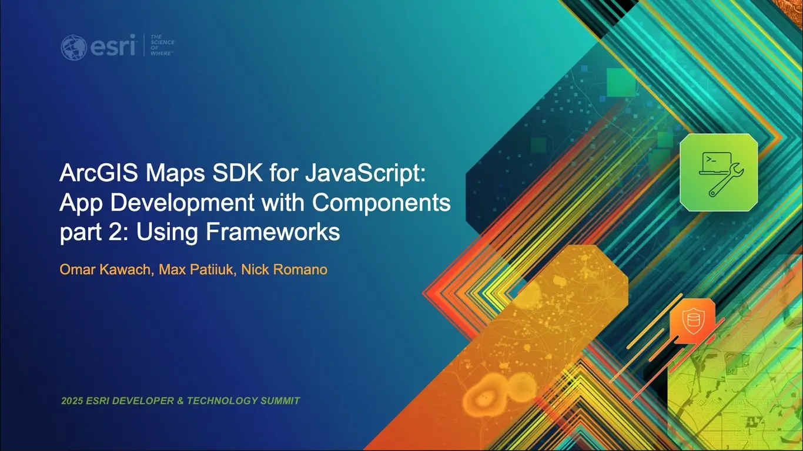

# ArcGIS Maps SDK for JavaScript: App Development with Components part 2: Using Frameworks

Join us for the second session in our three-part series on building applications
with the ArcGIS Maps SDK for JavaScript. This session will begin with exploring
motivations for using frontend frameworks, and then will cover techniques for
integrating the SDK's web components with frameworks and tools such as React and
Vite. We will touch on current frontend methodologies for topics such as
dependency management, asset management, semantic versioning, and conveniences
offered by frameworks that streamline web mapping application development
compared to plain JavaScript.

When: Wednesday, March 12 | 1:00 PM - 2:00 PM PDT

Where: Primrose B | Palm Springs Convention Center

Presenters: [Omar Kawach](https://github.com/omarkawach) &
[Max Patiiuk](https://github.com/maxpatiiuk) &
[Nicholas Romano](https://github.com/nick-romano)

Presented at [Esri Developer Summit 2025](https://devtechsummit2025.esri.com/).

[Slides](https://maxpatiiuk.github.io/esri-dev-summit-presentations/2025/using-components-2)

See
[Part 1](https://devtechsummit2025.esri.com/flow/esri/25epcdev/deveventportal/page/detailed-agenda/session/1730689428965001R0ur)
and
[Part 3](https://devtechsummit2025.esri.com/flow/esri/25epcdev/deveventportal/page/detailed-agenda/session/1730691473863001d3c1)

## Resources

### Vite ⚡

- [Final demo app](./demo/3-typescript)
- [Basic demo app](./demo/1-javascript)
- [Documentation](https://vitejs.dev/)
  - [Publishing guide](https://vite.dev/guide/static-deploy)

### Calcite Design System 💎

- [Documentation](https://developers.arcgis.com/calcite-design-system)
- [GitHub](https://github.com/Esri/calcite-components)
- [Esri Community](https://community.esri.com/t5/calcite-design-system/ct-p/calcite-design-system)
- [Custom Calcite themes](https://esrips.github.io/calcite-theme-editor/#theme)
- [Calcite demo samples](https://github.com/EsriDevEvents/dev-tech-summit-demo-templates)

### ArcGIS Maps SDK for JavaScript 📍

- [Documentation](https://developers.arcgis.com/javascript)
- [Get started (for NPM)](https://developers.arcgis.com/javascript/latest/get-started/#npm)
- [Maps SDK Resources](https://github.com/Esri/jsapi-resources)
- [React sample app](https://github.com/Esri/jsapi-resources/tree/main/component-samples/map-and-charts-components-react)
- [Disconnected environment tutorial](https://developers.arcgis.com/javascript/latest/working-with-assets/)

### React ⚛️

- [Demo app](./demo/2-react)
  - [Get started steps](./demo/2-react/README.md#key-changes-from-1-javascript)
- [Documentation](https://reactjs.org/)

### TypeScript 🦾

- [Demo app](./demo/3-typescript)
  - [Get started steps](./demo/3-typescript/README.md#key-changes-from-2-react)
- [Documentation](https://www.typescriptlang.org)
- [Guide to using ArcGIS Maps SDK for JavaScript with TypeScript](https://developers.arcgis.com/javascript/latest/get-started/#typescript)
- VS Code extension:
  - [Pretty TypeScript Errors](https://marketplace.visualstudio.com/items?itemName=yoavbls.pretty-ts-errors)
