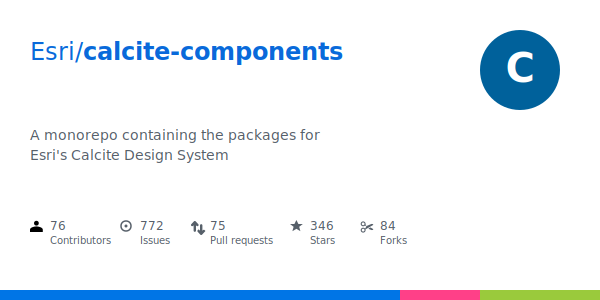

## ArcGIS Maps SDK for JavaScript:<br>A Look Under the Hood

Max Patiiuk, Thorben Westerhuys

---
is: feedback
---

---

# Agenda

- How Esri's largest monorepos works
  - What is a monorepo and why create it? 📐
  - What tooling is needed? ⚙️
  - Live Demo 🧪
- TODO: topic 2
  - TODO

---
layout: intro
---

# How Esri's largest<br>monorepo works

---

# Definition

> **Repository** - a version-controlled storage space that contains files
> belonging to a project. Commonly hosted on GitHub.

For example,
[Calcite components](https://github.com/Esri/calcite-design-system/tree/main) is
a single GitHub repository.

[](https://github.com/Esri/calcite-design-system/tree/main)

---

# 3 code organization patterns

- Monolith - a single large repository for a single project

  

- Polyrepo - scattered repositories

  

- Monorepo - a single repository with code split into packages

  

<!--
Monorepo is a way to organize code on a project where multiple teams need to collaborate.
The simplest way to explain what is a monorepo is to compare it to other code organization patterns.
-->

---

# Monolith


Single large repository for a single cohesive product.

Pros:

- The default approach when the project "just grows"
- Less tooling

Cons:

- Scaling bottlenecks (build times, IDE performance)
- High coupling

Esri examples: [esri-leaflet](https://github.com/Esri/esri-leaflet)<br>Community
examples: [TypeScript](https://github.com/microsoft/TypeScript),
[VSCode](https://github.com/microsoft/vscode)

---

# Polyrepo


Separate, but related repositories.

Pros:

- Low coupling. Each repository can move fast independently.

Cons:

- High duplication. Hard to keep things in sync.
- Local development tricky - juggling many repositories & dev servers.
- PRs and issues split between multiple repositories - disruptive

Esri examples: [EsriDevEvents](https://github.com/EsriDevEvents)<br>Community
examples: [express.js](https://github.com/expressjs) (split across 30
repositories)

---

# Monorepo


Many semi-independent packages under a common roof.​

Pros:​

- Control how much coupling you get.​
- **Consistent coding standards and tooling**.
- **Setup once, benefit many**.​

Cons:​

- More tooling complexity

Esri examples:
[calcite-design-system](https://github.com/Esri/calcite-design-system),
[jsapi-resources](https://github.com/Esri/jsapi-resources)<br>Community
examples: [react](https://github.com/facebook/react),
[vite](https://github.com/vitejs/vite)

---

# Example Monorepo structure

<!-- prettier-ignore -->
```yaml
- .github/           # Shared GitHub actions​
- .gitignore         # Single gitignore​
- eslint.config.js   # Single config​
- prettier.config.js # Single config​
- pnpm-lock.yaml     # Single lock file for the entire monorepo​
- packages/          # ...
```

---

# Example Monorepo structure - packages/

<!-- prettier-ignore -->
```yaml
- packages/
  - app/
  - utils/
  - build-utils/
  - configs/
```

---

# Esri's largest monorepo

<!-- prettier-ignore -->
```yaml
- packages/
  - map-packages/     # @arcgis/map-components, map-components-react, embeddable-components
  - coding-packages/  # @arcgis/coding-components, Arcade
  - charts-packages/  # @arcgis/charts-components, charts-components-react
  - core-packages/    # @arcgis/core
  - ...
  - docs-packages/    # Private, Internal, and External docs
  - test-packages/    # Test apps for verifying libraries
  - starter-packages/ # New monorepo package starters
  - samples-packages/ # Public sample & template packages
  - support-packages/ # Configs. Tooling
```

---

# Esri's largest monorepo - support-packages/

<!-- prettier-ignore -->
```yaml
- packages/
  - support-packages/
    - runtime-utils/          # DOM, Intl, logging
    - build-utils/            # Node.js file system and shell wrappers, package.json utils
    - monorepo-cli/           # Chores automation: linting, building, deploying, releasing
    - lumina-runtime/         # Base class for all web components (uses Lit)
    - lumina-compiler/        # Internal web component framework (uses Vite and TypeScript)
    - eslint-config/
    - prettier-config/
    - typescript-config/
    - storybook-config/
    - codemod/                # @arcgis/codemod: Codemods for migrating between frameworks or updating libraries
    - create-cli/             # @arcgis/create: CLI to bootstrap a new Maps SDK package
```

---
layout: intro
---

# Monorepo tooling

---

# Disclaimer

- This presentation covers our monorepo tooling stack
- Every team has their unique needs, baggage, and preferences​
- No tooling works universally​

Do your own research to find what is right for you

---

# Package manager

Used not just for installing external packages, but for linking monorepo
packages together.​

- npm (default for non-monorepo projects, simple)​
- yarn (most common in monorepos as it supported them first)​
- pnpm (modern, fast, protects against hacked dependencies)

[pnpm](https://pnpm.io/installation) and
[pnpm workspace](https://pnpm.io/workspaces) get started

---

# Turborepo build cache

- Build package once – reuse, if nothing changed​
- Build cache is shared between CI and all devs​
- Result: `pnpm build:all` "builds" thousands of files in 3s​

[Turborepo Introduction​](https://turborepo.dev/docs)

---
layout: center
---

# [Demo: pnpm + Turborepo](https://github.com/maxpatiiuk/monorepo-template)

---

# [Prettier](https://prettier.io/docs/)

Enforce consistent code formatting.

Recommendation:

- Create a single `prettier.config.js` at the monorepo root and lint changed
  files from monorepo root.

```js
// prettier.config.js
export default {
  singleQuote: true,
  proseWrap: 'always',
};
```

---

# [ESLint](https://eslint.org/docs/latest/use/getting-started)

Enforce consistent monorepo code standard.

Create an eslint-config package that contains:

- Rule configs
- ESLint plugins setup
- Custom monorepo-specific rules

Recommendation:

- single `eslint.config.js` for the entire monorepo (consistency by default)
- run lint from the monorepo root (simpler) for changed files only (faster)

---

# Linting setup

IDE plugin:

- Auto-fix on save & inline error - very convenient
- But, highly dependent on local IDE setup

Pre-commit:

- Quick feedback before the commit goes through
- But, limited performance budget to not slow down committing

CI check:

- Guaranteed & consistent check for all contributors
- But, slow feedback loop

---

# Pre-commit hook

Common tools: [husky](https://www.npmjs.com/package/husky/) together with
[lint-staged](https://github.com/lint-staged/lint-staged).

Example config:

```js
export default {
  '*.{ts,tsx}': ['eslint --fix', 'prettier --write'],
  '*.{css,scss,js,jsx,mjs,cjs,md,mdx,json,yml,yaml,json,html}':
    'prettier --write',
  '*.{ts,tsx,json}': 'yarn my-cli run-tests-for-changes',
  '*': 'yarn my-cli detect-large-files',
  './.gitattributes': () => 'git add --renormalize .',
};
```

---

# Bonus

- Use [pnpm catalogs](https://pnpm.io/catalogs) to keep dependency versions
  within monorepo consistent.
- Use [VitePress](http://vitepress.dev/) to build an internal docs site for your
  team/org.
- Use [codemods](https://ts-morph.com/) to automate large-scale refactoring.
- Use [commander](https://www.npmjs.com/package/commander) to create CLI scripts
  for automating monorepo chores.

You can find these, and more suggestions in our
[monorepo-template](https://github.com/maxpatiiuk/monorepo-template?tab=readme-ov-file#what-you-can-add-after-forking-the-template).

---

# Grow incrementally

We mentioned many tools. Don't get intimidated: you only need two to get
started: `pnpm` and `turbo`.

Everything else can be gradually added later as your team growth and you get
familiarity with tools.

---
layout: intro
---

# TODO: topic 2

---
layout: center
---

# Questions?

ArcGIS Maps SDK for JavaScript: Fast Development and Build Tooling

Demos and additional resources available at:
[arcg.is/esri-2025-build-tooling](https://arcg.is/esri-2025-build-tooling)

<!--

If you wish to dive deeper, you can find our demos and
additional resources at the URL above, or you can scan the QR code.
-->

---
src: ../.meta/footer.md
---
