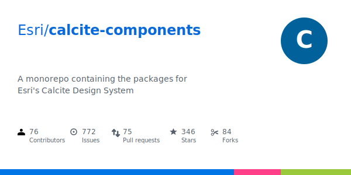
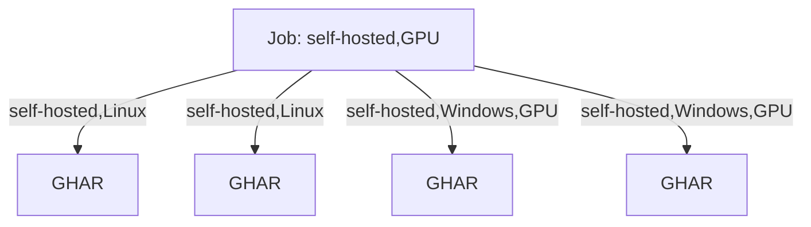
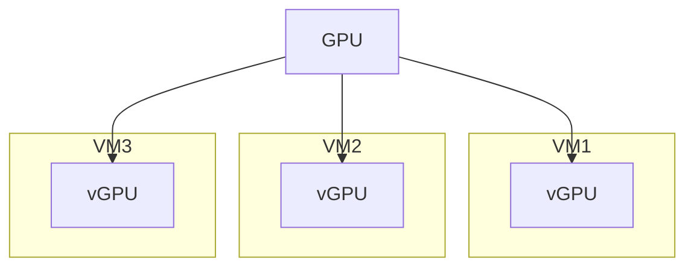
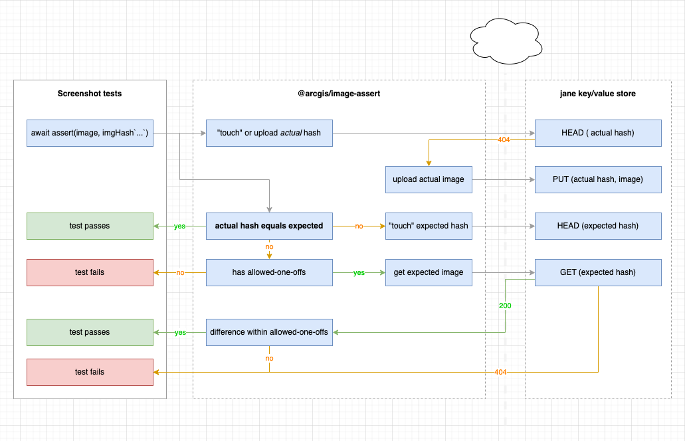
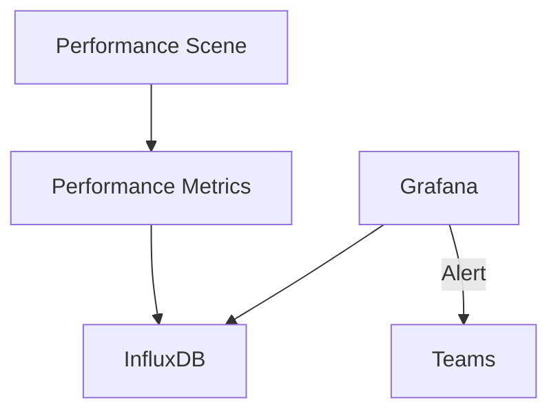
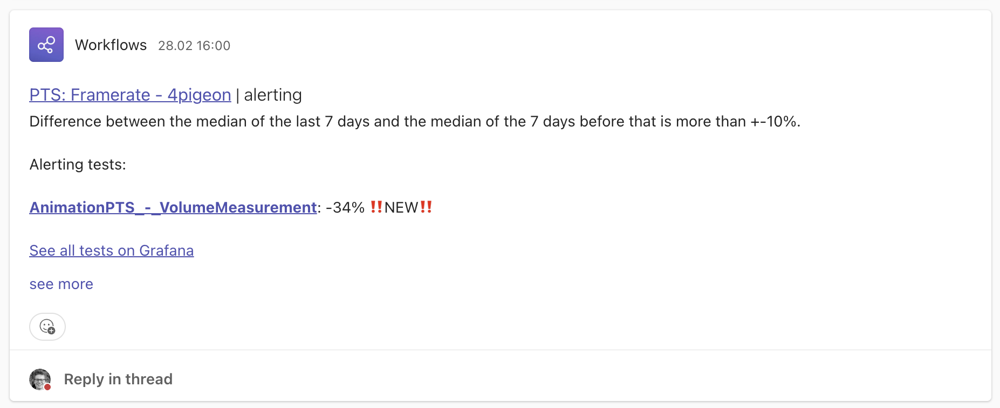

## ArcGIS Maps SDK for JavaScript:<br>A Look Under the Hood

Max Patiiuk, Thorben Westerhuys

---
is: feedback
---

---

# Agenda

- How Esri's largest JavaScript monorepo works
  - What is a monorepo and why create it? 📐
  - What tooling is needed? ⚙️
  - Live Demo 🧪
- Action Runners, screenshot and performance testing
  - From GitHub Actions to bare metal 🏗️
  - Screenshot testing at scale 📸
  - Automating performance testing on mobile 🧪

---
layout: intro
---

# How Esri's largest JavaScript <br>monorepo works

---

# Definition

> **Repository** - a version-controlled storage space that contains files
> belonging to a project. Commonly hosted on GitHub.

For example,
[Calcite components](https://github.com/Esri/calcite-design-system/tree/main) is
a single GitHub repository.

[](https://github.com/Esri/calcite-design-system/tree/main)

---

# 3 code organization patterns

- Monolith - a single large repository for a single project

  

- Polyrepo - scattered repositories

  

- Monorepo - a single repository with code split into packages

  

<!--
Monorepo is a way to organize code on a project where multiple teams need to collaborate.
The simplest way to explain what is a monorepo is to compare it to other code organization patterns.
-->

---

# Monolith


Single large repository for a single cohesive product.

Pros:

- The default approach when the project "just grows"
- Less tooling

Cons:

- Scaling bottlenecks (build times, IDE performance)
- High coupling

Esri examples: [esri-leaflet](https://github.com/Esri/esri-leaflet)<br>Community
examples: [TypeScript](https://github.com/microsoft/TypeScript),
[VSCode](https://github.com/microsoft/vscode)

---

# Polyrepo


Separate, but related repositories.

Pros:

- Low coupling. Each repository can move fast independently.

Cons:

- High duplication. Hard to keep things in sync.
- Local development tricky - juggling many repositories & dev servers.
- PRs and issues split between multiple repositories - disruptive
- Changes in one repository can break another - not visible till you try to
  update

Esri examples: [EsriDevEvents](https://github.com/EsriDevEvents)<br>Community
examples: [express.js](https://github.com/expressjs) (split across 30
repositories)

---

# Monorepo


Many semi-independent packages under a common roof.​

Pros:​

- Control how much coupling you get.​
- **Consistent coding standards and tooling**.
- **Any tooling and process improvement benefits many teams**.

Cons:​

- More tooling and CI complexity

Esri examples:
[calcite-design-system](https://github.com/Esri/calcite-design-system),
[jsapi-resources](https://github.com/Esri/jsapi-resources)<br>Community
examples: [react](https://github.com/facebook/react),
[vite](https://github.com/vitejs/vite)

---

# Example Monorepo structure

<!-- prettier-ignore -->
```yaml
- .github/            # Shared GitHub actions​
- .gitignore          # Single gitignore​
- eslint.config.js    # Single config​
- prettier.config.js  # Single config​
- pnpm-lock.yaml      # Single lock file for the entire monorepo​
- pnpm-workspace.yaml # Monorepo configuration file
- packages/           # ...
```

---

# Example Monorepo structure - packages/

<!-- prettier-ignore -->
```yaml
- packages/
  - app/
  - utils/
  - build-utils/
  - configs/
```

---

# Esri's largest monorepo

<!-- prettier-ignore -->
```yaml
- packages/
  - map-packages/     # @arcgis/map-components, map-components-react, embeddable-components
  - coding-packages/  # @arcgis/coding-components, Arcade
  - charts-packages/  # @arcgis/charts-components, charts-components-react
  - core-packages/    # @arcgis/core
  - ...
  - docs-packages/    # Private, Internal, and External docs
  - test-packages/    # Test apps for verifying libraries
  - starter-packages/ # New monorepo package starters
  - samples-packages/ # Public sample & template packages
  - support-packages/ # Configs. Tooling
```

---

# Esri's largest monorepo - support-packages/

<!-- prettier-ignore -->
```yaml
- packages/
  - support-packages/
    - runtime-utils/          # DOM, Intl, logging
    - build-utils/            # Node.js file system and shell wrappers, package.json utils
    - monorepo-cli/           # Chores automation: linting, building, deploying, releasing
    - lit-runtime/            # Base class for all web components (uses Lit)
    - lit-compiler/           # Internal web component framework (uses Vite and TypeScript)
    - eslint-config/
    - prettier-config/
    - typescript-config/
    - storybook-config/
    - codemod/                # @arcgis/codemod: Codemods for migrating between frameworks or updating libraries
    - create-cli/             # @arcgis/create: CLI to bootstrap a new Maps SDK package
```

---
layout: intro
---

# Monorepo tooling

---

# Disclaimer

- This presentation covers our monorepo tooling stack
- Every team has their unique needs, baggage, and preferences​
- No tooling works universally​

Do your own research to find what is right for you

---

# Package manager

Used not just for installing external packages, but for linking monorepo
packages together.​

- npm (default for non-monorepo projects, simple)​
- yarn (most common in monorepos as it supported them first)​
- pnpm (modern, fast, protects against hacked dependencies)

[pnpm](https://pnpm.io/installation) and
[pnpm workspace](https://pnpm.io/workspaces) to get started

---

# Turborepo build cache

- Build package once – reuse, if nothing changed​
- Build cache is shared between CI and all devs​
- Result: `pnpm build:all` "builds" thousands of files in 1s​

[Turborepo Introduction​](https://turborepo.dev/docs)

---
layout: center
---

# [Demo: pnpm + Turborepo](https://github.com/maxpatiiuk/monorepo-template)

---

# [Prettier](https://prettier.io/docs/)

Enforce consistent code formatting.

Recommendation:

- Create a single `prettier.config.js` at the monorepo root and lint changed
  files from monorepo root.

```js
// prettier.config.js
export default {
  singleQuote: true,
  proseWrap: 'always',
};
```

---

# [ESLint](https://eslint.org/docs/latest/use/getting-started)

Enforce consistent monorepo code standard.

Create an eslint-config package that contains:

- Rule configs
- ESLint plugins setup
- Custom monorepo-specific rules

Recommendation:

- single `eslint.config.js` for the entire monorepo (consistency by default)
- run lint from the monorepo root (simpler) for changed files only (faster)

---

# Linting setup

IDE plugin:

- Auto-fix on save & inline error - very convenient
- But, highly dependent on local IDE setup

Pre-commit:

- Quick feedback before the commit goes through
- But, limited performance budget to not slow down committing

CI check:

- Guaranteed & consistent check for all contributors
- But, slow feedback loop

---

# Pre-commit hook

Common tools: [husky](https://www.npmjs.com/package/husky/) together with
[lint-staged](https://github.com/lint-staged/lint-staged).

Example config:

```js
export default {
  '*.{ts,tsx}': ['eslint --fix', 'prettier --write'],
  '*.{css,scss,js,jsx,mjs,cjs,md,mdx,json,yml,yaml,html}': 'prettier --write',
  '*.{ts,tsx,json}': 'pnpm my-cli run-tests-for-changes',
  '*': 'pnpm my-cli detect-large-files',
  './.gitattributes': () => 'git add --renormalize .',
};
```

---

# Grow incrementally

We mentioned many tools. Don't get intimidated: you only need two to get
started: `pnpm` and `turbo`.

Everything else can be gradually added later as your team grows and you get
familiarity with tools.

If you have existing repositories, align lint rules and devops between them to
make move into the monorepo smoother.

---

# Bonus

- Use [pnpm catalogs](https://pnpm.io/catalogs) to keep dependency versions
  within monorepo consistent.
- Use [VitePress](http://vitepress.dev/) to build an internal docs site for your
  team/org.
- Use [codemods](https://ts-morph.com/) to automate large-scale refactoring.
- Use [commander](https://www.npmjs.com/package/commander) to create CLI scripts
  for automating monorepo chores.

You can find these, and **more suggestions** in our
[monorepo-template](https://github.com/maxpatiiuk/monorepo-template?tab=readme-ov-file#what-you-can-add-after-forking-the-template)
👈.

---

# Monorepo template & additional resources

ArcGIS Maps SDK for JavaScript: A Look Under the Hood

Demos and additional resources available at:
[arcg.is/esri-2026-under-the-hood](https://arcg.is/esri-2026-under-the-hood)


---
layout: intro
---

# Action Runners, screenshot and performance testing

---
layout: center
---

# From GitHub Actions to bare metal 🏗️

<!--
Over the last years we moved from Jenkins to GitHub Actions.
This allowed us to have a more declarative CI right inside the repo.
And it enabled a much broader adoption of automation. From traditional CI
workflows to many smaller tasks. Now I want to shift gears and talk a bit
about how we manage the infrastructure behind it.
-->

---

# What are GitHub Actions?

- A declarative way to define (repo) automation in YAML
- Terms worth knowing:
  - **Events**: Activity triggering a workflow
  - **Workflow**: A collection of jobs
  - **Job**: A collection of steps
  - **Step**: A set of steps
  - **Action**: Reusable set of steps

---

# Anatomy of a workflow

```yaml
# .github/workflows/test.yml
on: [push]

jobs:
  test:
    runs-on: ubuntu-latest
    steps:
      - uses: actions/checkout@v6
      - uses: actions/setup-node@v6
        with:
          node-version: 24

      - run: npm ci
      - run: npm run test
```

---
layout: image-right
image: ./assets/pull-request-workflow.png
backgroundSize: contain
---

# Pull request workflow

- Spawns up to 19 jobs
- Up to 6 of them are running tests
- We only run tests affected by the current change
- Tests need hardware accelerated graphics

---

# Self-hosted

<v-click hide>

```yaml
runs-on: ubuntu-latest
```

</v-click>
<v-after>

```yaml
runs-on: self-hosted
```

</v-after>

<!--
Lets start with something you might be familiar with. The `runs-on` syntax
inside a workflow. Most of you have probably seen these. But what happens?
It's GitHubs mechanism to match a request to run a workflow to a runner from
the pool. In the case of github.com this is a really, really large pool and
there are many runner types to choose from. Linux, Windows, macOS, small, medium,
large. But what if these are not available (e.g. you're running on GHES) 
or do not cover your needs?
-->

---

# Self-hosted runners

- Self managed pool of runners
- Runs on Linux, macOS and Windows


```mermaid
flowchart TD
    A[Job: self-hosted,GPU]
    A -->|self-hosted,Linux| D[GHAR]
    A -->|self-hosted,Linux| E[GHAR]
    A -->|self-hosted,Windows,GPU| F[GHAR]
    A -->|self-hosted,Windows,GPU| G[GHAR]
```

<!--
Then you can use self hosted runners. You define the machine, operating system,
installed software etc. All you need is to install the GitHub Action Runner
binary and register it to an organization or repo.
-->

---

# Our Pool

- Used by over 80 contributors, distributed globally
- In `@arcgis/core`: up to 20 new pull requests/workday
- Currently
  - ~50 GPU runners
  - ~16 general purpose Linux runners

↪ up to 10 PRs/merges in parallel

<!--
So how many runners would we need and how can you manage this many VMs?
-->

---

# Dedicated GPU

- Screenshot testing needs hardware accelerated GPU context
- Nvidia vGPU: Allocates a virtual GPU slice to each VM


```mermaid
flowchart TD
  A[GPU]

  subgraph VM1
    vm1vgpu[vGPU]
  end
  subgraph VM2
    vm2vgpu[vGPU]
  end
  subgraph VM3
    vm3vgpu[vGPU]
  end

  A --> vm1vgpu
  A --> vm2vgpu
  A --> vm3vgpu
```

---

# How to manage them

- _Goal_: No manual deployment and configuration of VMs
- Pre-built base image and system configuration
- Shared between teams
- Infrastructure as code
- Versioned using git
- Using pull requests to preview, code review and apply

<!--
With declarative infrastructure. Leaning on the same ideas that
make GitHub Actions powerful while staying accessible, we manage
our internal infrastructure such as self hosted runners using 
infrastructure as code, versioned in git.
-->

---

# A simple VM

- HCL (Hashicorp configuration language)

```hcl {|5-8|10|12-13}
module "devops-platform" "dts-2026" {
  vm_name     = "dts-2026"
  os          = "rocky"

  cpu_num   = 16
  memory    = 64
  disk_size = 300
  vms_count = 1

  authorize_users = ["devandtech26"]

  team     = "web"
  location = "vegas"
}
```

<!--
So how does that look in practice? This is a definition of a simple
VM with 16 vCPU cores, 64GB of memory, 300GB of disk assigned to the web team
and located in Las Vegas. It is based on the devops-platform module, which 
defines how to translate this definition into actual resources, e.g. talking
to the platform orchestrator or cloud provider, configuring the network etc.
-->

---

# Runner VM

```hcl {|2,6,10,15-18}
module "platform-action-runner-2" "webgis-runner-win" {
  os          = "win11"
  vm_name     = "webgis-runner-win"

  size      = "custom"
  gpu       = true
  cpu_num   = 8
  ...

  enable_workspace_cleanup = true

  team     = "web"
  location = "vegas"

  gh_token        = ...
  gh_owner        = "WebGIS"
  gh_runner_group = "js-runner-group"
  custom_labels   = ["gpu"]
}
```

<!--
Back to the runners. How are they defined. Very similar. Additions here are the
base OS image, whether we want to have access to a GPU, if we do some extra cleanup
and most importantly the GitHub token, owner (organization or repo) and runner group as
well as any custom labels to later be used in a workflow. That's all. This will create
a VM from the chosen base image, install the GitHub Action runner binary and register
it in the chosen organization automatically.
-->

---

# Demo: Pull request workflow

<!--
Now let's see a change in action. When we want to update the number of VMs or
the size we simple do so in the code and create a pull request. Once pushed,
a platform bot automatically picks up the change and test runs the changes.
It then shows the summary, a collegue can code review and once you're happy
you can type `platform apply`. Once the apply finishes and your infrastructure
change is made, you can merge the pull request.
-->

---

# Summary

- Define once, scale as needed
- Fix issues and roll out to all runners
- State of the infrastructure is reflected in the code
- Preview and code review changes before applying
- Changes are traceable (through git)

---
layout: center
---

# Screenshot testing at scale 📸

<!--
So what is this runner infrastructure used for? For once, we run
screenshot tests on it.
-->

---

# The numbers

`@arcgis/core`

- ~1.2M SLOC
- ~24k unit tests and ~5.2k integration tests
- 4.5k screenshot tests being run
- often multiple screenshots per test

<!--
Why you might ask? The SDK is a highly visual and interactive product, running
on top of WebGL. The code base roughly grew by 20% year of year to 1.2 million
lines of code. The same is true for the unit and integration tests. But as you
can see we also have about 4.5k screenshot tests. These often assert multiple
screenshots per tests, so we are talking about roughly 10k screenshots.
-->

---

# Image hashes

- Use image hashes
- CI as authoritative baseline

```ts
await expectations.assert(
  image,
  imgHash`0c19fde99101cc38f1d70a50159ea05115b22e1f`,
);
```

---

# Demo: Dashboard

<!--
- Show screenshot failures in CI dashboard
-->

---
layout: two-cols
---

# Workflow

- Locally hash screenshot
- If hashes match: test passes
- If hashes do not match:
  - Has an allowed one-off: fetch expected image and compare using one-off
    threshold
  - Otherwise fail

::right::

<div class="mt-12 pl-4">



</div>

---

# Tooling

- CI Dashboard to inspect failures
- Test reporter integration
- VSCode plugin to show screenshot on hover
- cli script to update larger batches (e.g. browser related)

---

# Summary

- Screenshots are stored as hashes in the code
- Allows fast local comparisons for thousands of screenshots
- Shared storage for the screenshots

---
layout: center
---

# Automating performance testing on mobile 🧪

<!--
The third topic moves a bit away from traditional testing. To make sure
the SDK stays highly interactive and we always know where to improve, we
are running automated performance tests on reference hardware. Recently
we extended this to mobile.
-->

---

# Performance Testing

- Rendering in WebGL in the browser is highly interactive
- New features can regress FPS, latency, or memory in subtle ways
- Automated tests create **repeatable history** and **comparable baselines**
- Manual testing is error prone, time consuming, and hard to reproduce

---

# Automated Tests

- Reproducible setup (scene, camera, layers, ...)
- Allows averages over multiple runs
- Detect regressions during feature development
- Evolve into long‑term regression tests

---

# Framerates

| FPS   | Responsiveness | Expected user reaction          |
| ----- | -------------- | ------------------------------- |
| 120   | 💚💚💚         | Good experience in VR           |
| > 60  | 💚💚           | Good experience                 |
| > 30  | 💚             | Working fluently is possible    |
| 10–30 | 💛             | Noticeable stutter, short usage |
| 5–10  | 💔             | Limited interaction             |

---
layout: two-cols
---

# Approach

- Set of curated performance scenes
- Runs in-browser
- Custom instrumentation to get or estimate metrics
- Once test ends, send collected data to time series backend
- Visualize in Grafana
- Alerts for significant changes

::right::

<div class="pl-6 mt-12">


```mermaid
flowchart TD
  PTS[Performance Scene] --> Metrics
  Metrics[Performance Metrics] --> InfluxDB
  Grafana --> InfluxDB
  Grafana -->|Alert| Teams
```

</div>

---

# Alert in Teams



---

# Demo: Grafana Dashboard

<!--
- Show the regression in Grafana
-->

---

# Hardware

<v-clicks>

- Office Lab
  - macOS laptop
  - Linux laptop with integrated graphics
- On CI: Windows 11 with vGPU slice
- Mobile devices on BrowserStack: Android phone, iPad, ...

</v-clicks>

---

# BrowserStack Automate

```yml
matrix:
  test: [
      # Android phone
      {
        browser: 'Chrome',
        deviceName: 'Samsung Galaxy',
        deviceGeneration: 'S23',
        osVersion: '13.0',
        session: 'bstack-Galaxy-S23-chrome',
        deviceOrientation: 'portrait',
        scenes: 'Boston-Urban,BuildingE,StormDrains,TrafficAndTrees,Utrecht',
      },
      ...,
    ]
```

<!--
- Play video of WebScenes running on an Android S25
-->

---

# Demo: Mobile Performance data in Grafana

---

# Summary

- Performance tests are essential to catch regressions early
- Alerts ensure data and changes are monitored
- Run on real hardware

---
layout: center
---

# Questions?

ArcGIS Maps SDK for JavaScript: A Look Under the Hood

Demos and additional resources available at:
[arcg.is/esri-2026-under-the-hood](https://arcg.is/esri-2026-under-the-hood)


<!--
If you wish to dive deeper, you can find our demos and
additional resources at the URL above, or you can scan the QR code.
-->

---
src: ../.meta/footer.md
---
