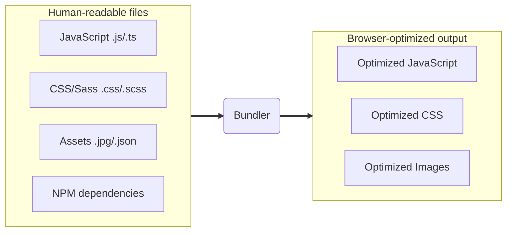

## ArcGIS Maps SDK for JavaScript:<br>Using Vite for Building Fast, Dynamic Web Apps

Hugo Campos, Max Patiiuk

---
is: feedback
---

---

# Agenda

- Introduction to bundlers
- Building an app
  - Get started with Vite
  - Add dependencies
  - Use TypeScript and ESLint
  - Publish the app
- Enhance the app
  - Lazy load parts of the application
  - Analyze bundles with Sonda
  - Add tests with Vitest
  - Add custom plugins

<!--
Quick tour of app building...based on what Esri teams are doing
-->

---

# What are bundlers?

Bundlers transform the code that is easiest for developers to write into code
that is most performant for the browser to run.



---

# Bundler benefits

1. Optimizes performance (reduce file sizes, split bundles...)
2. Improves development experience (live updates...)
3. Permits consumption of NPM packages
4. Makes testing code simpler

Bonus: can extend the bundler using plugins

---

# Examples of bundlers

- Vite
- Parcel
- Webpack

---

# Vite

- Most popular bundler today
- Used by many Esri teams
- Great developer experience
- Large and rapidly growing community

---
layout: center
---

# Demo: [Get started with Vite](https://github.com/maxpatiiuk/esri-dev-summit-presentations/tree/main/2026/build-tooling/demo/1-javascript)

<!--
- Create a Vite starter project
- Start the dev server and show how simple it is to use
- Show index.html, main.js, Splash.js, package.json
  - Similar to no-build-step apps
- Show live update
-->

---

## React

- As app grows, it benefits from more structure
- The most popular JavaScript library for building dynamic user-interfaces
- Build anything out of small Components
- JSX (JavaScript Syntax Extension).
  - `return <h1>Hello World! 👋</h1>;`
  - JavaScript code in HTML-like syntax

---
layout: center
---

# Demo: [Add basic React 19](https://github.com/maxpatiiuk/esri-dev-summit-presentations/tree/main/2026/build-tooling/demo/2-react)

---

# Calcite Design System

- Library of 50 reusable web components
- Provides consistent and accessible UI out of the box
- Works with any framework

---
layout: center
---

# Demo: [Add Calcite and JS Maps SDK components](https://github.com/maxpatiiuk/esri-dev-summit-presentations/tree/main/2026/build-tooling/demo/3-web-components)

---

## TypeScript

Most developers see great benefit from adding TypeScript to their projects:

> TypeScript: catch your bugs before your users do

- Auto-magically ✨ provides better autocomplete and inline documentation
- Helps with code refactoring
- Encourages self-documenting code

Essential part of every ArcGIS Online app at Esri

<!--
That's a lot of promises - lets see TypeScript in action by adding it to our
project.
-->

---
layout: center
---

# Demo: [Adopt TypeScript](https://github.com/maxpatiiuk/esri-dev-summit-presentations/tree/main/2026/build-tooling/demo/4-typescript)

---

# ESLint

- Optional, but very helpful on projects with multiple developers
- Enforce consistent code style on your team
- Catch some issues that TypeScript can't (like bad coding patterns)
- Autofix some issues for you

---
layout: center
---

# Demo: [Use ESLint](https://github.com/maxpatiiuk/esri-dev-summit-presentations/tree/main/2026/build-tooling/demo/5-eslint)

---

# Publishing

- You learned Vite, React, Calcite, Map Components, TypeScript, ESLint - now
  what?
- Let's publish the app!

<!--
That's it for the main tools Esri teams use to build their apps
Now comes the question - how do you get your app out there?
-->

---

# Demo: Publishing the app

Do a production build:

```sh
npm run build
```

Deploy the `dist` folder anywhere!

- any hosting provider (GitHub Pages, Vercel)
- or local server (NGINX, Microsoft IIS, Apache)

<!--
- The output is index.html and static files - same as no-build-step apps
  - Show off single minified JavaScript file
- Can be deployed to any hosting provider (GitHub Pages, Vercel) or local server (NGINX, Microsoft IIS, Apache)
-->

---

# Fun fact

These slides are built with Vite and hosted on GitHub Pages! ✨

(with help from [Slidev](https://sli.dev/))

---

# Demo summaries

- **Vite ⚡** simplifies the development workflow
- **React ⚛️** makes it easy to do complex things in a maintainable way
- **Calcite 💎** provides ready to use user interface components
- **TypeScript 🦾** catches bugs before your users do
- **ESLint 🚩** ensures the code style stays consistent

---
layout: intro
---

# Enhance the app

<!--
Now let’s look at how we can make apps faster and easier to maintain.

We’ll look at:
- Lazy loading and routes
- Bundle analysis
- Testing
- Vite plugins
-->

---

# Routes and Lazy loading

- Only load source files when needed
- Split app into multiple entry points
- Simplest split: by page or route

<!--
Most apps have multiple pages, and a lot of code.

Instead of loading everything up front, we only load what the user needs for the page they’re on.

Routes give us a really natural split:
start small on a splash page, and load the “real app” only when the user goes there.
-->

---
layout: center
---

# Demo: [Lazy loading & routes with React Router](https://github.com/maxpatiiuk/esri-dev-summit-presentations/tree/main/2026/build-tooling/demo/6-routes)

<!--
We’ll start on the splash page first.

Now when we go to the map route, that’s when the heavier code loads.

The nice part is this is just standard React patterns: lazy + dynamic import.
Vite turns that into a separate bundle automatically.
-->

---

# Bundle analysis with Sonda

- Visualize what ends up in your production bundle
- Uses source maps to inspect post-tree-shaking and minified output
- Find large or duplicated dependencies before they impact users
- Works with Vite, Rollup, Rolldown, Webpack, esbuild, etc

<!--
Sometimes bundles can get big, even with lazy loading. Sonda is a great tool to understand why.
-->

---
layout: center
---

# Demo: [Analyze bundles with Sonda](https://github.com/maxpatiiuk/esri-dev-summit-presentations/tree/main/2026/build-tooling/demo/7-sonda)

<!--
All I need is to add the Sonda plugin to my Vite config.
After doing a production build, I can view the report in the browser.

First, look at the treemap: big boxes are big parts of your bundle.

Then we can click around and see what pulls those chunks in.
That makes it much easier to decide what to optimize.
-->

---

# Testing

Testing: if you're not doing it, you should. Vitest makes it super easy to write
tests:

- Fast with familiar API
- Supports modern language features
- Run tests in Node or the browser
- Direct integration with Vite

<!--
As it says on the slide, if you’re not writing tests, you should be.

These days, using tools like Vitest makes it really easy to get started.

For UI + maps, browser-mode tests are a great fit and Vitest has built-in support for that.
- real clicks and pointer events
- stable, mocked APIs

And it all integrates directly with Vite so you can use the same config and plugins for your tests as you do for your app.
-->

---
layout: center
---

# Demo: [Add tests with Vitest](https://github.com/maxpatiiuk/esri-dev-summit-presentations/tree/main/2026/build-tooling/demo/8-testing)

<!--
Let's look at a couple of tests that cover real user behavior.

We render the app, click on the map, and confirm the UI updates.

We can also simulate an API failure and confirm we show an error.

The key ideas: fast, repeatable, and close to how users interact.
-->

---

# Custom plugins

- Vite plugins are flexible and easy to write
- Powerful way to enhance builds or developer workflows

<!--
Sometimes you need to do something that's not built into Vite.

It comes with a rich plugin API that lets you hook into the build process and dev server.

Common use-cases:
- Dev server helpers (middleware)
- Build-time tooling (analysis, transforms), like Sonda which we saw earlier
-->

---
layout: center
---

# Demo: [Add custom plugins](https://github.com/maxpatiiuk/esri-dev-summit-presentations/tree/main/2026/build-tooling/demo/9-plugins)

<!--
To exemplify this, we built custom plugin that makes the dev server “unreliable” on purpose.

If we run the app with "chaos mode" enabled, the plugin will randomly delay responses and fail some requests.

This is a great way to test loading states and error handling without touching app logic.
-->

---

# Demo summaries

- **Lazy loading 🚀** improves app performance
- **Sonda 📦** helps visualize and optimize bundle size
- **Testing with Vitest 🧪** makes it easy to write and maintain tests
- **Custom plugins 🔌** provides a powerful way to enhance workflows

<!--
Big idea: you don’t need a new stack to scale an app.

Just add a few simple practices:
- Split by route
- Measure and optimize bundle size with tools like Sonda
- Add good tests (AI agents make this easier than ever!)
- Use plugins when you need custom behavior
-->

---

# In conclusion...

- Bundlers like Vite help your app grow and stay maintainable
- They offer plenty of control and developer experience enhancements
- They pair well with testing tools like Vitest to ensure your app is
  production-ready

---
layout: center
---

# Questions?

ArcGIS Maps SDK for JavaScript: Fast Development and Build Tooling

Demos and additional resources available at:
[arcg.is/esri-2026-build-tooling](https://arcg.is/esri-2026-build-tooling)


<!--
If you wish to dive deeper, you can find our demos and
additional resources at the URL above, or you can scan the QR code.
-->

---
src: ../.meta/footer.md
---
