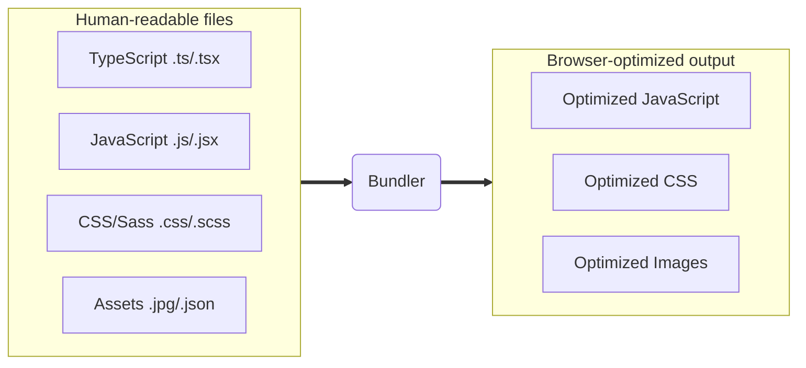

## ArcGIS Maps SDK for JavaScript: App Development with Components,<br>Part 2: Using Frameworks

Omar Kawach, Max Patiiuk, Nicholas Romano

---
is: feedback
---

---

# Previous session (yesterday)

App Development with Components Part 1: Core Patterns

> Join us for the third session in our three-part series on building
> applications with the ArcGIS Maps SDK for JavaScript. This session is focused
> on building the user experience in your web app with the SDK's components and
> Calcite Design System. Calcite provides a library of patterns, icons, and
> user-friendly, configurable web components that enable developers to easily
> build responsive, accessible web applications. We'll demonstrate how the
> components can be used together to build intuitive yet powerful experiences in
> your apps.

If you missed the previous session, we have a recording. These 3-part sessions
build on top of each other

---

# Today's session

2nd in a 4-part series

- We will cover:
  - Calcite
  - ArcGIS Maps SDK for JavaScript
  - Bundlers
  - Frameworks

---

# Calcite Design System 💎

- An extensive library of reusable web components for designing compelling apps
- Provides consistent, customizable, responsive and accessible UI out of the box
- Works with any framework
- Will be covered in more detail by the 3rd session in this 3-part series

---

# ArcGIS Maps SDK for JavaScript 📍

- A comprehensive and powerful WebGIS mapping library
- Now simpler to use thanks to web components
- Core JavaScript API
  - Provides the main functionality. Contains the classes, methods, properties,
    events and type definitions for all the layers, components, visualization
    and client-side analysis functionality.
- JavaScript Maps SDK Components
  - Standards-based web components designed to encapsulate complex functionality
    (core API) and styling (Calcite) into small HTML markup chunks (i.e., UI)
- Documentation
  - Get started, programming patterns, tutorials, samples and API / component
    references

---

# Prebuilt versus building the SDK and Calcite

- Script tag applications are quick to get started
  - No build step - the SDK and Calcite are prebuilt for you via the ArcGIS CDN
  - Only need a single HTML file
  - Syntax for including modules:
    - `require(["esri/WebMap"], (WebMap) => { /* code goes here */ });`
- Building an application that scales is more involved
  - Work with a bundler (Vite, Parcel, Webpack)
  - Use a framework (React, Angular, Vue)
    - Routing and state management
  - Syntax for including modules:
    - `import { WebMap } from "@arcgis/core/WebMap";`

---

# index.html demo

> in previous session you saw how to write quick index.html app quick to get
> started and easy for simple apps

---
layout: intro
---

# Using Bundlers

---

# What are bundlers?

Bundlers transform the code that is easiest for developers to write into code
that is most performant for the browser to run.



---

# Bundler benefits

- Improve development experience (live updates...)
- Enable modern syntax features and dependencies
- Make testing code simpler
- Optimize performance (reduce file sizes, split bundles...)
- Allow extending capabilities with plugins

---

# Examples of bundlers

- Vite ⚡
  - Most popular bundler today
  - Used by many Esri teams
  - Great developer experience
  - Large and rapidly growing community
- Parcel
- Webpack

---
layout: center
---

# Demo: [Get started with Vite](https://github.com/maxpatiiuk/esri-dev-summit-presentations/tree/main/2026/using-components-2/demo/1-javascript)

<!--
- Describe converting index.html app to Vite
  - use jsapi-resources starter app
- Start the dev server and show how simple it is to use
- Show index.html, main.js
- Show live update
-->

---

# Dependencies

- Your application can consume other packages
- Use npmjs.com to find packages or find out the latest version number

---

# Dependency vs devDependency

package.json:

```json
  // Required for the app to run
  "dependencies": {
    "@arcgis/map-components": "^5.0.0-next.99",
    "@esri/calcite-components": "^5.0.0-next.38",
    "react": "^19.2.3",
    "react-dom": "^19.2.3"
  },
  // Only used during development/build
  "devDependencies": {
    "vite": "^7.3.0",
    "typescript": "5.9.3",
    "@vitejs/plugin-react": "^5.1.2",
    "@types/react": "^19.2.7",
    "@types/react-dom": "^19.2.3"
  }
```

---

# Semantic versioning

`<major>.<minor>.<patch>` (example: `5.0.0`)

- **major**: breaking changes - read the release notes
- **minor**: new features - safe to update
- **patch**: bug fixes - safe to update

---

# Semantic versioning ranges

Rather than specifying an exact version, you can let NPM decide which version to
install:

- `^5.0.0` - any version from 5.0.0 to 6.0.0 (features and bug fixes)
- `~5.0.0` - any version from 5.0.0 to 5.1.0 (only bug fixes)

Allows for dependency sharing (multiple packages can use single Calcite)

---

# Publishing

1. Run the build command: `npm run build`
2. Deploy the `dist` folder anywhere!
   - any hosting provider (GitHub Pages, Vercel)
   - or local server (NGINX, Microsoft IIS, Apache)

<!--
- Vite team working on 4x speedup in build time
- The output is index.html and static files - same as no-build-step apps
  - Show off single minified JavaScript file
- Can be deployed to any hosting provider (GitHub Pages, Vercel) or local server (NGINX, Microsoft IIS, Apache)
- Mention assets can be made fully self-hosted
-->

---

# Fun fact

These slides are built with Vite and hosted on GitHub Pages! ✨

(with help from [Slidev](https://sli.dev/))

---

# Asset handling

- By default, component assets are loaded from Esri's fast CDN
- This includes translation files and images
- They can be made
  [fully self-hosted](https://developers.arcgis.com/javascript/latest/disconnected-environment/)
  if needed

---
layout: intro
---

# Using frameworks

---

# Frameworks

- Frameworks make app development easier by providing more structure to the way
  we write applications
- React is most popular, but Angular and Vue are also widely used
- Web components work in most major frameworks because they are standards-based

---

# React ⚛️

- Most popular framework / library
- Encourages building app from "components" - reusable building blocks
- Top down data flow
- Declarative rendering and events
  - JSX syntax, which is a mix of JavaScript and HTML
- Easy state management with "hooks"
- React19 has support for web components out of the box

---
layout: center
---

# Demo: [Get started with React](https://github.com/maxpatiiuk/esri-dev-summit-presentations/tree/main/2026/using-components-2/demo/2-react)

<!--
- show differences to file extension
- show how JSX is used, such as event handlers and props
- highlight how we no longer have to use query selector
- highlight the event listening logic

Script:

1. show package.json
  - added react and react-dom package
  - added vite react plugin

2. Show vite.config.js
  - added vite react plugin

3. Show index.html
  - now its just a very simple html template with a "root" div

4. show main.jsx (highlight .jsx extension)
  - bootstrap our app with react-dom, this is the entrypoint to our react application

5. show app.jsx
  - event.target > what's "target"
  - event.detail > what's "event.detail"

6. show the app
-->

---

# Summary of benefits from react

- Declarative rendering
- Easy to pass properties to components
- Easier event logic
- No need for query selectors
- Easy to consume web components

---
layout: two-cols
---

<template v-slot:default>

# Vanilla JavaScript: <br/> Setting Events and Properties

#### HTML

```html
<body>
  <calcite-chip id="distance"></calcite-chip>
  <calcite-chip id="elevation"></calcite-chip>
  <arcgis-map item-id="5fe7222cfd4e41cab4321cc1fde66cc2" id="map"> </arcgis-map>
  <arcgis-elevation-profile reference-element="map"></arcgis-elevation-profile>
</body>
```

</template>

<template v-slot:right v-click>

#### JavaScript

```js
// Get references to the components we need to interact with
const elevationProfile = document.querySelector('arcgis-elevation-profile');
const distanceElement = document.getElementById('distance');
const elevationElement = document.getElementById('elevation');
if (!elevationProfile || !distanceElement || !elevationElement) {
  throw Error('Error: Unable to find DOM elements');
}

// Watch for "progress" changes on the elevation profile component
elevationProfile.addEventListener('arcgisPropertyChange', (event) => {
  // 1 = complete
  if (event.detail.name !== 'progress' || elevationProfile.progress !== 1) {
    return;
  }
  const profiles = elevationProfile.profiles;
  const statistics = profiles.at(0)?.statistics;
  const elevationGain = round(statistics?.elevationGain);
  const distance = round(statistics?.maxDistance);
  elevationElement.textContent = `${elevationGain} ${elevationProfile.effectiveUnits.elevation}`;
  distanceElement.textContent = `${distance} ${elevationProfile.effectiveUnits.distance}`;
});
```

</template>

<!--
Notes

- Query selectors are used to get references to the components.
- Event listeners are added to listen for changes on the elevation profile component.
- You can imagine how this code would grow in complexity as more components are added to the page.
-->

---
layout: two-cols
---

<style>
  .two-columns {
    gap: 2rem;
  }
</style>

<template v-slot:default>

# React

#### HTML

```html
<body>
  <div id="root"></div>
</body>
```

</template>
<template v-slot:right v-click>

#### JSX

```jsx
// initialize state variables
const [ distance, setDistance ] = useState(undefined);
const [ elevation, setElevation ] = useState(undefined);

const handleElevationProfileChange = (event) => {
  if (event.detail.name !== "progress" || event.target.progress !== 1) {
    return;
  }
  const profiles = event.target.profiles;
  const statistics = profiles.at(0)?.statistics;
  const elevationGain = round(statistics?.elevationGain);
  const distance = round(statistics?.maxDistance);
  setElevation(`${elevationGain} ${event.target.effectiveUnits.elevation}`);
  setDistance(`${distance} ${event.target.effectiveUnits.distance}`);
}

return (
  {distance && (<calcite-chip id="distance">{distance}</calcite-chip>)}
  {elevation && (<calcite-chip id="elevation">{elevation}</calcite-chip>)}
  <arcgis-elevation-profile
    onarcgisPropertyChange={handleElevationProfileChange}
  ></arcgis-elevation-profile>
);

```

</template>

<!--
React combines logic and markup into the same file.

This makes it easier to understand the component's behavior and how it interacts with the rest of the application.

React also provides a way to manage state and lifecycle events in a more predictable way.

Declarative rendering makes it easier to understand what the component will look like based on its state.
-->

---

# TypeScript 🦾

- Typescript is a superset of JavaScript
- Adds static types to JavaScript
- Improves developer experience and code quality
- The Maps SDK's components and Calcite's components come with TypeScript
  definitions out of the box

---
layout: center
---

# Demo: [Get started with React + TypeScript](https://github.com/maxpatiiuk/esri-dev-summit-presentations/tree/main/2026/using-components-2/demo/3-typescript)

<!--
- Show tsconfig
- Show how to web component types use types in React
- Highlight the syntax highlighting and intellisense
- Show error when passing wrong type
- Maybe add a new method to the app component and show how to use the typings?
-->

---

# Summary of benefits from TypeScript

- Improved developer experience
- Static types
- Intellisense
- Error checking
- Give us more confidence in the code we write

---

# Other frameworks

- Angular and Vue also support web components.
- [Getting started with Angular](https://developers.arcgis.com/javascript/latest/get-started-angular/)
- [Vue Sample Application](https://github.com/Esri/jsapi-resources/tree/main/component-samples/map-components/samples/vue)
- [jsapi-resources](https://github.com/Esri/jsapi-resources/tree/main/component-samples/map-components/samples/vue)
  repo has samples for all frameworks

---

# Next session

ArcGIS Maps SDK for JavaScript: App Development with Components, Part 3: User
Experience (Deeper Calcite UX best practices)

**When**: Tomorrow (Thursday, March 13) | 10:30 AM - 11:30 AM PDT

**Where**: Primrose A | Palm Springs Convention Center

> Join us for the third technical session in a four-part series on building
> applications with the ArcGIS Maps SDK for JavaScript. This session focuses on
> building the user experience in your web app with the SDK's components and
> Calcite Design System. Calcite provides a library of patterns, icons, and
> user-friendly, configurable web components that enable you to easily build
> responsive, accessible web applications. Speakers demonstrate how the
> components can be used together to build intuitive yet powerful experiences in
> your apps.

---

# ArcGIS Maps SDK for JavaScript: Using Vite for Building Fast, Dynamic Web Apps (tomorrow)

Deeper Vite and Vitest guide - shows how Esri is building apps

**When**: Tomorrow (Wednesday, March 12) | 4:00 PM - 5:00 PM PDT

**Where**: Mohave Learning Center | Palm Springs Convention Center

> This technical session explores a case study on how Esri's development teams
> are leveraging modern tools like Vite to build fast, dynamic web GIS
> applications. With features such as lazy loading, client-side routing, hot
> module replacement, and lightning-fast builds, Vite streamlines the entire
> development workflow from bundling to deployment. Paired with Vitest for
> testing, these tools help ensure that your apps are both high-performing and
> production-ready.

---
layout: center
---

# Questions?

ArcGIS Maps SDK for JavaScript: App Development with Components, Part 2: Using
Frameworks

Demos and additional resources available at:
[arcg.is/esri-2025-using-components-2](https://arcg.is/esri-2025-using-components-2)


<!--
If you wish to dive deeper, you can find our demos and
additional resources at the URL above, or you can scan the QR code.
-->

---
src: ../.meta/footer.md
---
