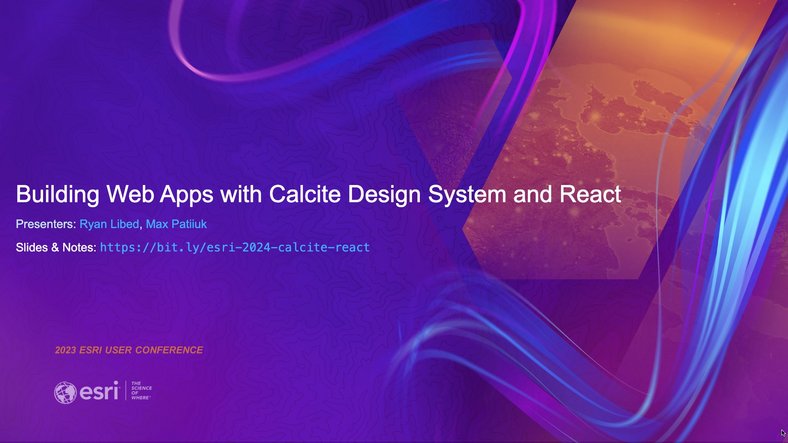

# DevSummit-presentation

## 2024

### Building web apps with Calcite Design System and React

[Slides and Notes](./2024/calcite-react/)

Looking to enrich your spatially-enabled React Apps? Join us to discover the
power of integrating Calcite Components and React to craft a superior user
experience. We'll dive into the ArcGIS Maps SDK for JavaScript’s ES modules,
showing you how to seamlessly incorporate web mapping into your applications.
Whether you're new to Calcite or seeking to deepen your skills, this session
will offer you actionable insights to take your projects to the next level.

Presenters: [Ryan Libed](https://github.com/rslibed) &
[Max Patiiuk](https://github.com/maxpatiiuk)

### ArcGIS Maps SDK for JavaScript: Tips and Tricks for Developing and Debugging Apps

[Slides and Notes](./2024/debugging-tips-and-tricks/)

Learn how to quickly and easily find and fix problems in your web mapping
applications. You will learn how to setup your dev environment to use plug-ins
like linters and beautifiers to write cleaner code. We'll show you how to use
the power of browser-based debugging tools to debug, style, and optimize your
apps. We will also cover how to resolve common issues you may run into when
working with the ArcGIS Maps SDK for JavaScript.

Presenters: [Max Patiiuk](https://github.com/maxpatiiuk) &
[Noah Sager](https://github.com/NoashX)
