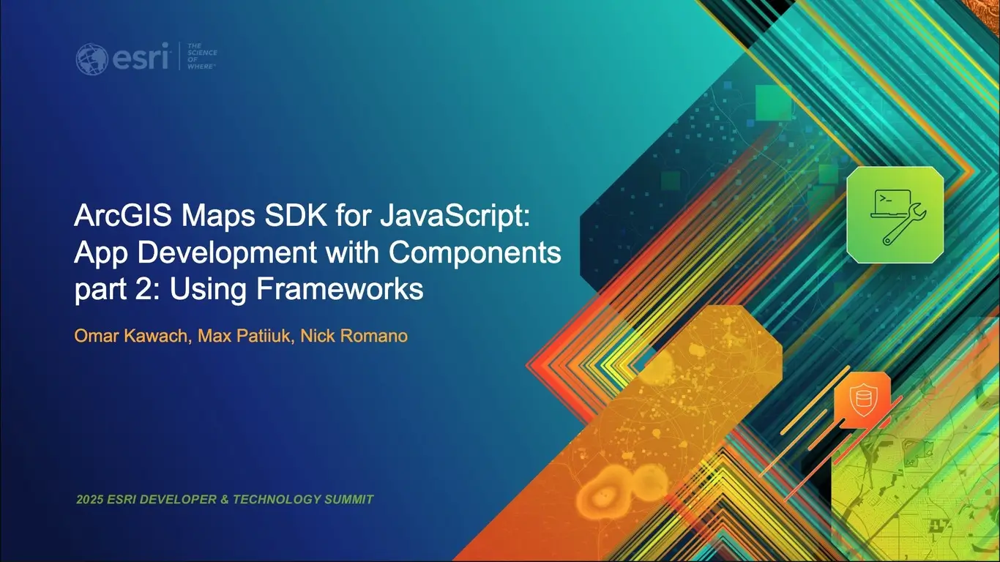
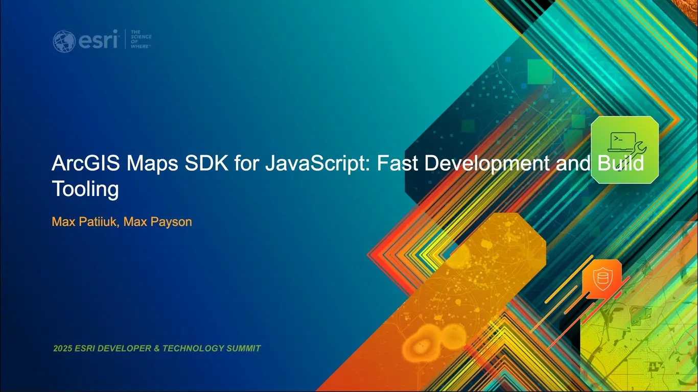

# Esri DevSummit Presentations

## 2026

### [ArcGIS Maps SDK for JavaScript: App Development with Components, Part 2: Using Frameworks](./2026/using-components-2)

[Slides and Demos](./2026/using-components-2)

Join us for the second technical session in a four-part series on building
applications with the ArcGIS Maps SDK for JavaScript. Speakers begin with
exploring motivations for using front-end frameworks and then cover techniques
for integrating the SDK's web components with frameworks and tools such as React
and Vite. The session touches on current front-end methodologies for topics such
as dependency management, asset management, semantic versioning, prebuilt versus
built applications that scale, and conveniences offered by frameworks that
streamline web mapping app development compared to plain JavaScript.

Presenters: [Omar Kawach](https://github.com/omarkawach) &
[Max Patiiuk](https://github.com/maxpatiiuk) &
[Nicholas Romano](https://github.com/nick-romano)

### [ArcGIS Maps SDK for JavaScript: Using Vite for Building Fast, Dynamic Web Apps](./2026/build-tooling)

[Slides and Demos](./2026/build-tooling)

This technical session explores a case study on how Esri's development teams are
leveraging modern tools like Vite to build fast, dynamic web GIS applications.
With features such as lazy loading, client-side routing, hot module replacement,
and lightning-fast builds, Vite streamlines the entire development workflow from
bundling to deployment. Paired with Vitest for testing, these tools help ensure
that your apps are both high-performing and production-ready.

Presenters: [Hugo Campos](https://bsky.app/profile/hugocampos.bsky.social) &
[Max Patiiuk](https://github.com/maxpatiiuk)

### [ArcGIS Maps SDK for JavaScript and 3D GIS Visualization: A Developer's Guide Beyond 2D Cartography](./2026/vis-techniques-3d)

Discover how ArcGIS Maps SDK for JavaScript unlocks powerful 3D visualization on
the web. This technical session dives into symbol types, visual variables, and
cartographic techniques unique to 3D, showing how to transform 2D features into
rich thematic 3D views. Through live demonstrations, see how to work with key 3D
data layers—including Indexed 3D Scene (I3S), integrated mesh, and building
scene layers—and learn best practices to create compelling, interactive
experiences that bring your GIS data to life.

Presenters: [Hugo Campos](https://github.com/hcampos-professional) &
[Thorben Westerhuys](https://github.com/twesterhuys)

### [ArcGIS Maps SDK for JavaScript: A Look Under the Hood](./2026/a-look-under-the-hood)

[Slides and Demos](./2026/a-look-under-the-hood)

Come to this technical session to discover the engineering infrastructure that
powers the ArcGIS Maps SDK for JavaScript. We will focus on two key topics:

Get an inside look at Esri’s largest monorepo. We will demonstrate how we
structure our codebase to allow a dozen teams to collaborate, build, and deploy
from a single repository.

Learn how we manage and scale our supporting infrastructure and leverage
infrastructure-as-code and GitOps to enable GPU-based screenshot, performance
testing and more.

Presenters: [Max Patiiuk](https://github.com/maxpatiiuk) &
[Thorben Westerhuys](https://github.com/twesterhuys)

## 2025

### [ArcGIS Maps SDK for JavaScript: App Development with Components part 2: Using Frameworks](./2025/using-components-2)

[Slides and Demos](./2025/using-components-2)

Join us for the second session in our three-part series on building applications
with the ArcGIS Maps SDK for JavaScript. This session will begin with exploring
motivations for using frontend frameworks, and then will cover techniques for
integrating the SDK's web components with frameworks and tools such as React and
Vite. We will touch on current frontend methodologies for topics such as
dependency management, asset management, semantic versioning, and conveniences
offered by frameworks that streamline web mapping application development
compared to plain JavaScript.

Presenters: [Omar Kawach](https://github.com/omarkawach) &
[Max Patiiuk](https://github.com/maxpatiiuk) &
[Nicholas Romano](https://github.com/nick-romano)

### [ArcGIS Maps SDK for JavaScript: Fast Development and Build Tooling](./2025/build-tooling)

[Slides and Demos](./2025/build-tooling)

Learn how Esri's development teams are leveraging modern tools like Vite to
build fast, dynamic Web GIS applications. With features such as lazy loading,
client-side routing, hot module replacement, and lightning-fast builds, Vite
streamlines the entire development workflow from bundling to deployment. Paired
with Vitest for testing, these tools help ensure that your apps are both
high-performing and production-ready.

Presenters: [Max Payson](https://github.com/mpayson) &
[Max Patiiuk](https://github.com/maxpatiiuk)

### [Gaming with ArcGIS Maps SDK for JavaScript - geo-io](./2025/geo-io)

[Slides and Demo](./2025/geo-io)

Dive into how ArcGIS Maps SDK for JavaScript can be (mis)used for creating a
video game. Presenting to you: geo-io - like Agar.io, but more mappy! Powerful
geo-rendering capabilities of the Maps SDK allow for creative applications in
unintended areas, showing it's versatility.

Presenter: [Max Patiiuk](https://github.com/maxpatiiuk)

## 2024

### [Building web apps with Calcite Design System and React](./2024/calcite-react)

[Slides and Notes](./2024/calcite-react/)

Looking to enrich your spatially-enabled React Apps? Join us to discover the
power of integrating Calcite Components and React to craft a superior user
experience. We'll dive into the ArcGIS Maps SDK for JavaScript’s ES modules,
showing you how to seamlessly incorporate web mapping into your applications.
Whether you're new to Calcite or seeking to deepen your skills, this session
will offer you actionable insights to take your projects to the next level.

Presenters: [Ryan Libed](https://github.com/rslibed) &
[Max Patiiuk](https://github.com/maxpatiiuk)

### [ArcGIS Maps SDK for JavaScript: Tips and Tricks for Developing and Debugging Apps](./2024/debugging-tips-and-tricks/)

[Slides and Notes](./2024/debugging-tips-and-tricks/)

Learn how to quickly and easily find and fix problems in your web mapping
applications. You will learn how to setup your dev environment to use plug-ins
like linters and beautifiers to write cleaner code. We'll show you how to use
the power of browser-based debugging tools to debug, style, and optimize your
apps. We will also cover how to resolve common issues you may run into when
working with the ArcGIS Maps SDK for JavaScript.

Presenters: [Max Patiiuk](https://github.com/maxpatiiuk) &
[Noah Sager](https://github.com/NoashX)

### [Gaming with ArcGIS Maps SDK for JavaScript - 3D Tetris Game](./2024/tetris-react)

[Trailer](https://youtu.be/LlDgH-NZ3KE) ∙
[Play online](https://maxpatiiuk.github.io/tetris-react/) ∙
[Source code](https://github.com/maxpatiiuk/tetris-react)

Dive into how ArcGIS Maps SDK for JavaScript can be (mis)used for creating a 3D
Tetris Game. Powerful geo-rendering capabilities of the Maps SDK allow for
creative applications in unintended areas, showing it's versatility.

Presenter: [Max Patiiuk](https://github.com/maxpatiiuk)

